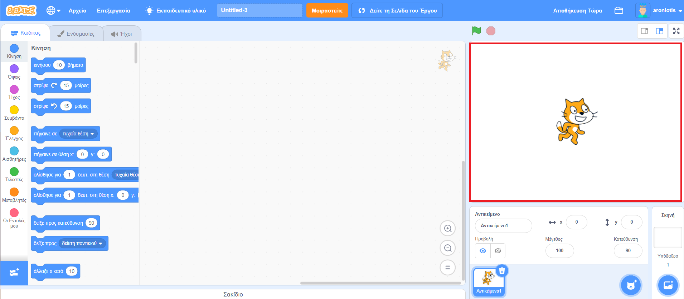
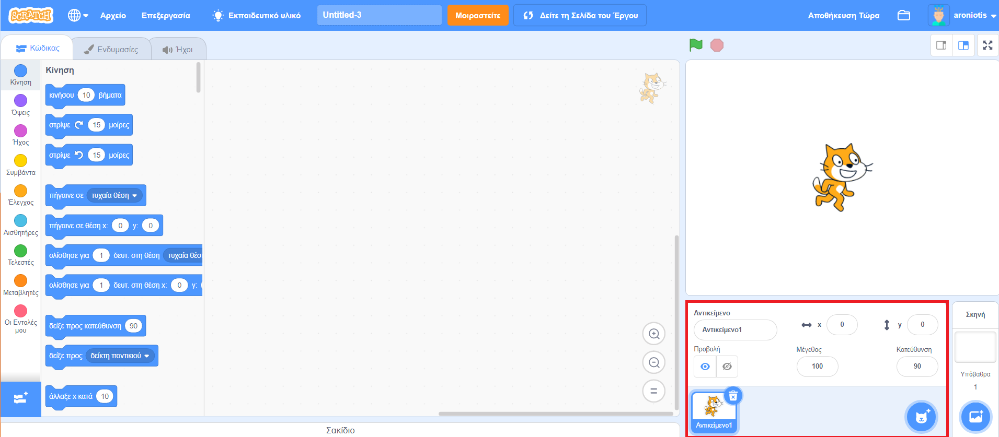
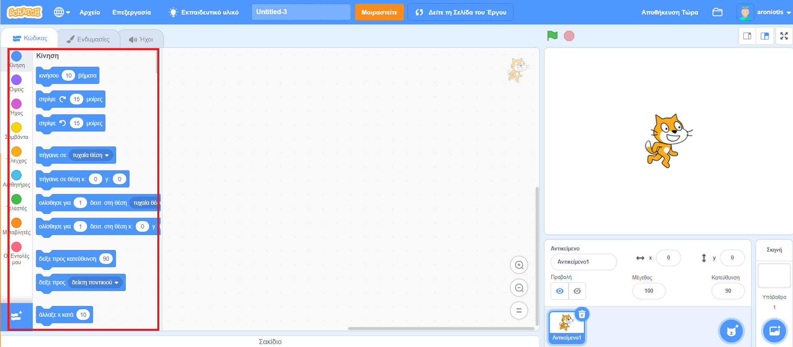
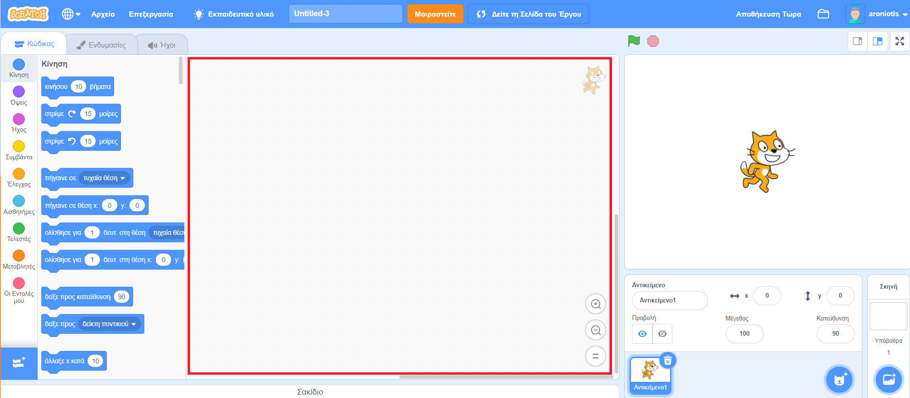

## Ρύθμιση

Μόλις ανοίξεις το Scratch, θα δεις ένα παράθυρο όπως το παρακάτω.

+ Δες καθεμία από τις παρακάτω περιοχές και να θυμάσαι πού βρίσκονται.

### Η σκηνή

 

--- collapse ---
---
title: Τι είναι η σκηνή;
---
Εκεί εκτελούνται τα προγράμματα στο Scratch. Περιλαμβάνει:

* Ένα ή περισσότερα **υπόβαθρα** \(εικόνες φόντου στο πίσω μέρος της οθόνης\)

* Οποιοδήποτε **μπλοκ κώδικα** που σχετίζεται με αυτή \(θα το δούμε αργότερα\)

--- /collapse ---

### Η λίστα των αντικειμένων

 

--- collapse ---
---
title: Τι είναι ένα αντικείμενο;
---

Κάθε στοιχείο που υπάρχει στη σκηνή είναι ένα **αντικείμενο**.

Το αντικείμενο περιλαμβάνει:
* Την **εικόνα** στη σκηνή
* Τις επιπλέον **ενδυμασίες** \(εικόνες\) που μπορεί να έχει
* **Ήχους** που μπορεί να συνδέονται με αυτό
* Οποιαδήποτε **μπλοκ κώδικα** που συνδέονται με αυτό 

--- /collapse ---

### Η παλέτα εντολών

 

--- collapse ---
---
title: Μπλοκ κώδικα
---

Ο κώδικας στο Scratch έχει τη μορφή μπλοκ που συνδέονται μεταξύ τους και σχηματίζουν προγράμματα. Επιλέγεις μπλοκ από την **παλέτα εντολών**, τα σέρνεις στην **περιοχή του επιλεγμένου αντικειμένου** και, στη συνέχεια, τα ενώνεις μεταξύ τους.

Υπάρχουν δέκα κατηγορίες μπλοκ. Είναι χρωματικά κωδικοποιημένες και μπορείς να επιλέξεις ανάμεσά τους κάνοντας κλικ στα στοιχεία της λίστας στο επάνω μέρος της **παλέτας εντολών**.

--- /collapse ---

### Η περιοχή του επιλεγμένου αντικειμένου

 

--- collapse ---
---
title: Τι είναι το επιλεγμένο αντικείμενο;
---

Το **επιλεγμένο αντικείμενο** είναι αυτό που έχει επιλεχθεί στη **λίστα αντικειμένων**.

Η **περιοχή του επιλεγμένου αντικειμένου** είναι εκεί που μπορείς να δεις τον κώδικα, τις ενδυμασίες και τους ήχους του επιλεγμένου αντικειμένου.

--- /collapse ---

Ώρα για κώδικα! Πήγαινε πίσω στο Scratch και κάνε κλικ στη γάτα Scratch στη λίστα αντικειμένων. Η γάτα είναι τώρα το επιλεγμένο αντικείμενο.

--- task ---

Πήγαινε στο μενού **Συμβάντα** της **παλέτας εντολών**, κάνε κλικ στην εντολή `όταν γίνει κλικ σε πράσινη σημαία`{:class="block3events"} και σύρε το στην **περιοχή του επιλεγμένου αντικειμένου**.

```blocks3
+    όταν γίνει κλικ σε πράσινη σημαία
```

--- /task ---

--- task ---

Μετά πήγαινε στις **Όψεις** στην **παλέτα εντολών** και βρες αυτό το μπλοκ

```blocks3
    πες [Γεια!] για (2) δευτερόλεπτα
```

Σύρε το στην **περιοχή του επιλεγμένου αντικειμένου**, συνδέοντάς το στο κάτω μέρος του άλλου μπλοκ, ως εξής:

```blocks3
    όταν γίνει κλικ σε green flag
    πες [Γεια!] για (2) δευτερόλεπτα
```

--- /task ---

--- task ---

Τώρα κάνε κλικ στο κουμπί **Ξεκίνα** και δες τι συμβαίνει!

--- /task ---

