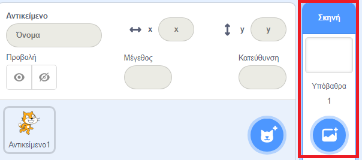
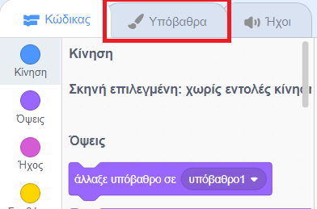
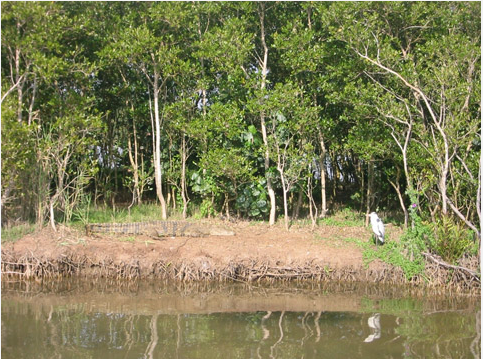
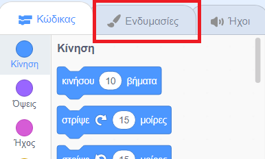
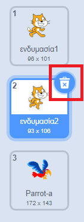

## Στήνοντας τη σκηνή

Το Scratch διαθέτει μια βιβλιοθήκη από έτοιμα υπόβαθρα και αντικείμενα για να κάνεις να έργα σου να φαίνονται υπέροχα.

--- task ---

Επίλεξε τη Σκηνή.

Κάνε κλικ στα **Υπόβαθρα**.

Κάνε κλικ στο **Διαλέξτε ένα υπόβαθρο από τη βιβλιοθήκη**.

Στη συνέχεια, επίλεξε το αγαπημένο σου φόντο από τους Εξωτερικούς Χώρους!

--- /task ---

Εξαιρετικά! Τώρα ας μετατρέψουμε τη γάτα σε παπαγάλο!

--- task ---

Αρχικά, επίλεξε το αντικείμενο της γάτας και κάνε κλικ στην καρτέλα **Ενδυμασίες**.

Στη συνέχεια, κάνε κλικ στο **Επιλέξτε Ενδυμασία**

Επίλεξε έναν παπαγάλο και κάνε κλικ **OK**.

Τώρα αφαίρεσε τις ενδυμασίες της γάτας επιλέγοντας καθεμία από αυτές και κάνοντας κλικ στο **x**.

--- /task ---

Εξαιρετικά! Τώρα έχεις έναν παπαγάλο!
