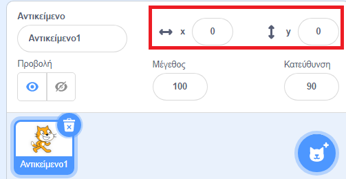

## Κίνηση αντικειμένων

Τώρα ο παπαγάλος σου κινείται σε κύκλο και θα ήταν πολύ πιο διασκεδαστικό να τον ελέγχεις με τα βελάκια του πληκτρολογίου; Σε αυτό το βήμα, θα μάθεις πώς να το κάνεις αυτό!

--- task ---

Ξεκίνησε διαγράφοντας όλο τον κώδικα που έχεις για τον παπαγάλο.

--- /task ---

Όπως μάλλον μάντεψες, πάλι θα χρειαστείς μπλοκ από τις κατηγορίες **Συμβάντα** και **Κίνηση**!


Αυτή τη φορά, βρες αυτό το μπλοκ και σύρε το στην περιοχή του επιλεγμένου αντικειμένου:

```blocks3
    when [space v] key pressed
```

Κάνε κλικ στο βελάκι (▼) δίπλα στο `διάστημα`. Θα δεις μια λίστα με όλα τα κουμπιά του πληκτρολογίου σου, τα οποία μπορείς να επιλέξεις.

--- task ---

Θα χρειαστείς τέσσερα από αυτά τα μπλοκ και μπορείς να τα συνδέσεις στα μπλοκ **Κίνησης** όπως:

```blocks3
+    when [left arrow v] key pressed
+    move (-10) steps
```

```blocks3
+    when [right arrow v] key pressed
+    move (10) steps
```

```blocks3
+    when [up arrow v] key pressed
```

```blocks3
+    when [down arrow v] key pressed
```

--- /task ---

**Σημείωση**: `-10` σημαίνει 'πήγαινε πίσω 10 βήματα'.

--- task ---

Τώρα κάνε κλικ στην πράσινη σημαία και πάτησε τα βελάκια του πληκτρολογίου σου για να ελέγξεις τον κώδικα.

--- /task ---

Τώρα ο παπαγάλος σου κινείται πίσω και μπροστά, κάτι που είναι αρκετά εντυπωσιακό, αλλά δεν κινείται πάνω (και) κάτω. Επίσης, αν κοιτάξεις το μπλοκ **Κίνηση**, θα δεις ότι δεν υπάρχουν μπλοκ για 'πάνω' ή 'κάτω'. Υπάρχουν όμως πολλά μπλοκ που σχετίζονται με συντεταγμένες **x** και **y** - ας δοκιμάσουμε αυτά τότε!

--- task ---

Σύρε δύο μπλοκ `άλλαξε y κατά`{:class="block3motion"} και άλλαξε τον κώδικα ως εξής:

```blocks3
    when [left arrow v] key pressed
    move (-10) steps
```

```blocks3
    when [right arrow v] key pressed
    move (10) steps
```

```blocks3
    when [up arrow v] key pressed
+    change y by (10)
```

```blocks3
    when [down arrow v] key pressed
+    change y by (-10)
```

--- /task ---

Τώρα όταν πατηθούν τα βελάκια, ο παπαγάλος μπορεί να κινηθεί σε όλη τη σκηνή!

--- collapse ---
---
title: Πώς λειτουργούν οι συντεταγμένες x και y;
---

Όταν οι προγραμματιστές θέλουμε να μιλήσουμε για τις θέσεις των αντικειμένων, όπως η γάτα ή ο παπαγάλος σου, χρησιμοποιούμε συχνά τις συντεταγμένες **x** και **y** για να τις περιγράψουμε. Ο **άξονας x** τρέχει από αριστερά προς τα δεξιά, ενώ ο **άξονας y** τρέχει από κάτω προς τα πάνω.


Ένα αντικείμενο μπορεί να εντοπιστεί από τις συντεταγμένες του κέντρου του, για παράδειγμα `(15, -27)`, όπου `15` είναι η θέση του κατά μήκος του άξονα x και `-27` η θέση του κατά μήκος του άξονα y.

+ Για να δοκιμάσεις πώς λειτουργεί αυτό, επίλεξε αντικείμενο και όρισε διαφορετικές τιμές για τις συντεταγμένες `x` και `y` για να μετακινηθεί το αντικείμενο γύρω από τη σκηνή.



+  Δοκίμασε διαφορετικά ζευγάρια τιμών για να δεις πού πηγαίνει το αντικείμενο! Στο Scratch, ο άξονας x ξεκινά από `-240` και φτάνει ως το `240`, ενώ ο άξονας y ξεκινά από `-180` και φτάνει έως το `180`.

--- /collapse ---

### Επανεκκίνηση του παιχνιδιού

Ο παπαγάλος κινείται σε όλη την οθόνη, αλλά φαντάσου ότι είναι ένα παιχνίδι: πώς το επανεκκινείς; Πρέπει να μεταφέρεις τον παπαγάλο στην αρχική του θέση, όταν ξεκινήσει το παιχνίδι. Το παιχνίδι ξεκινάει κάνοντας κλικ στην πράσινη σημαία, οπότε πρέπει να αλλάξεις τις συντεταγμένες `x` και `y` του παπαγάλου όταν συμβεί αυτό.

Αυτό είναι πολύ εύκολο! Το κέντρο της σκηνής είναι `(0, 0)` σε συντεταγμένες `x` και `y`.

Έτσι, το μόνο που χρειάζεσαι είναι το μπλοκ με την πράσινη σημαία από τα **Συμβάντα** και το μπλοκ **πήγαινε σε θέση x και y** από την **Κίνηση**.

--- task ---

Σύρε ένα μπλοκ `όταν γίνει κλικ σε πράσινη σημαία`{:class="block3events"} από τα **Συμβάντα** στην περιοχή του επιλεγμένου αντικειμένου.

```blocks3
+    when green flag clicked
```

Στη συνέχεια βρες το μπλοκ `πήγαινε σε θέση`{:class="block3motion"} από την καρτέλα **Κίνηση** και ένωσε το με το μπλοκ της πράσινης σημαίας.

```blocks3
    when green flag clicked
+    go to x: (0) y: (0)
```

Βάλε και στις δύο συντεταγμένες `x` και `y` τιμή `0` στο μπλοκ `πήγαινε στη θέση`{:class="block3motion"}, εάν δεν είναι ήδη `0`.

--- /task ---

--- task ---

 Τώρα κάνε κλικ στην πράσινη σημαία: θα πρέπει να δεις τον παπαγάλο να επιστρέφει στο κέντρο της σκηνής.

--- /task ---
