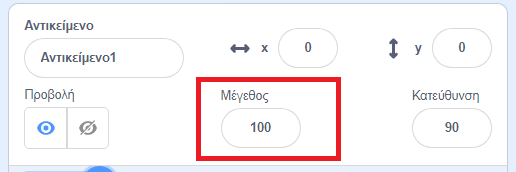
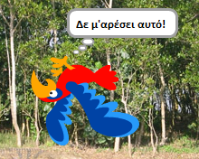

## Όλα τα αντικείμενα

Τώρα έχεις έναν παπαγάλο που μπορεί να μετακινηθεί χρησιμοποιώντας τα βελάκια. Τέλεια! Ώρα να προσθέσουμε και κανένα κουνούπι!

--- task ---

Κάντε κλικ στο εικονίδιο **Επιλέξτε ένα Αντικείμενο**. Το Scratch δεν έχει έτοιμες ενδυμασίες για κουνούπια, οπότε θα πρέπει να σχεδιάσεις ένα!


Εάν το κουνούπι σου είναι λίγο μεγάλο σε σύγκριση με τον παπαγάλο, μπορείς να χρησιμοποιήσεις τον έλεγχο μεγέθους για να έχεις και τα δύο αντικείμενα στο σωστό μέγεθος!



Άλλαξε τον αριθμό στον έλεγχο μεγέθους για να κάνεις το αντικείμενο μεγαλύτερο ή μικρότερο.

--- /task ---

Τέλεια! Αργότερα, θα προσθέσεις κάποιες εντολές για να κάνεις το κουνούπι να κινείται μόνο του, χωρίς βοήθεια από τον παίκτη. Ο παίκτης σας θα είναι ο παπαγάλος, προσπαθώντας να πιάσει το κουνούπι.

--- collapse ---
---
title: Τι γίνεται με τον παπαγάλο που πάει προς τα πίσω;
---

Φαίνεται λίγο αστείο όταν ο παπαγάλος πετάει προς τα πίσω. Ακριβώς, όπως συνήθως θα γύριζες ανάποδα αντί να περπατάς προς τα πίσω, ο παπαγάλος γυρίζει ανάποδα αντί να πετάει προς τα πίσω. Ευτυχώς για σένα, το Scratch έχει ένα μπλοκ για αυτό!

Το μπλοκ `δείξε προς κατεύθυνση`
{:class="block3motion"} σου επιτρέπει να επιλέξεις την κατεύθυνση που δείχνει το αντικείμενο. Θα το βρεις στην καρτέλα **Κίνηση**. Μπορείς να πληκτρολογήσεις οποιονδήποτε αριθμό μοιρών περιστροφής, για να στρίψει το αντικείμενο προς οποιαδήποτε κατεύθυνση θέλεις.

--- /collapse ---

--- task ---

Πάρε μερικά μπλοκ `δείξε προς κατεύθυνση`{:class="block3motion"} από την **Κίνηση** και ένωσέ τα με τον κώδικα του παπαγάλου σου, ως εξής:

```blocks3
    when [left arrow v] key pressed
+    point in direction (-90)
    move (-10) steps
```

```blocks3
    when [right arrow v] key pressed
+    point in direction (90)
    move (10) steps
```

--- /task ---

--- task ---

Δεδομένου ότι ο παπαγάλος έχει γυρίσει, άλλαξε την κατεύθυνση που πετάει, όταν πατηθεί το αριστερό βελάκι:

```blocks3
    when [left arrow v] key pressed
    point in direction (-90)
+    move (10) steps
```

--- /task ---

Εάν προσπαθήσεις να μετακινήσεις τον παπαγάλο τώρα, αφού έχεις προσθέσει το μπλοκ `δείξε προς κατεύθυνση`{:class="block3motion"}, μπορεί να παρατηρήσεις κάτι περίεργο. Ο παπαγάλος μάλλον στρίβει λίγο παράξενα!



--- collapse ---
---
title: Γιατί πηγαίνει ανάποδα;
---

Το πρόβλημα εδώ είναι ότι το αντικείμενο παπαγάλος ξεκίνησε, όπως κάνουν όλα τα αντικείμενα, με τον **τρόπο περιστροφής** 'τριγύρω' και αυτό που χρειάζεται είναι το 'αριστερά-δεξιά'.

Ως συνήθως, υπάρχει ένα μπλοκ για αυτό, και βρίσκεται στην **Κίνηση**!

--- /collapse ---

--- task ---

Ψάξε στην κατηγορία **Κίνηση** για το μπλοκ `όρισε τρόπο περιστροφής`{:class="block3motion"}.

Πρόσθεσε το μπλοκ στην αρχή του κώδικα του παπαγάλου και όρισε τον τρόπο περιστροφής σε `αριστερά-δεξιά`{:class="block3motion"}, όπως αυτό:

```blocks3
    when green flag clicked
+    set rotation style [left-right v]
    go to x: (0) y: (0)
```

--- /task ---

