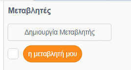

## Μέτρηση της βαθμολογίας

Για να μετράς τη βαθμολογία για το πόσα κουνούπια πιάνει ο παίκτης, θα χρειαστείς κάπου να την αποθηκεύεις, να βρεις έναν τρόπο να προσθέτεις πόντους σε αυτή και έναν τρόπο επαναφοράς της κατά την επανεκκίνηση του παιχνιδιού.

--- task ---

Πρώτον: αποθήκευση! Κάνε κλικ στην καρτέλα **Μεταβλητές** και, στη συνέχεια, κάνε κλικ στη **Δημιουργία Μεταβλητής**.



Βάλε για όνομα τη `βαθμολογία`.


Δες τη νέα μεταβλητή σου και τα μπλοκ για αυτήν!


--- /task ---

--- collapse ---
---
title: Τι είναι οι μεταβλητές;
---

Όταν θέλεις να αποθηκεύσεις πληροφορίες σε ένα πρόγραμμα, χρησιμοποιείς κάτι που ονομάζεται **μεταβλητή**. Σκέψου το σαν ένα κουτί με μια ετικέτα: μπορείς να βάλεις κάτι μέσα σε αυτό, να ελέγξεις τι υπάρχει και να αλλάξεις αυτό που βρίσκεται μέσα με κάτι άλλο. Θα βρεις τις μεταβλητές στο μενού **Μεταβλητές**, αλλά πρέπει να τις δημιουργήσεις πρώτα!

--- /collapse ---

Τώρα πρέπει να ενημερώσεις τη μεταβλητή κάθε φορά που ο παπαγάλος τρώει ένα κουνούπι και να την επαναφέρεις κάθε φορά που ξεκινάει το παιχνίδι:

--- task ---

--- /task ---

Από τις **Μεταβλητές**, πάρε τα μπλοκ `όρισε [η μεταβλητή μου] σε [0]`{:class="block3variables"} και `άλλαξε [η μεταβλητή μου] κατά [1]`{:class="block3variables"}. Σε κάθε ένα από τα μπλοκ, κάνε κλικ στο βελάκι και από τη λίστα επίλεξε τη `βαθμολογία`. Στη συνέχεια τοποθέτησε τα μπλοκ στο πρόγραμμά σου:

--- task ---

### Κώδικας για τον παπαγάλο

```blocks3
    when green flag clicked
+    set [score v] to [0]
    set rotation style [left-right v]
    go to x: (0) y: (0)
```

### Κώδικας για το κουνούπι

```blocks3
    if <touching [Sprite1 v] ?> then
+        change [βαθμολογία v] by [1]
        hide
        wait (1) secs
        go to x: (pick random (-240) to (240)) y: (pick random (-180) to (180))
        show
    end
```

--- /task ---

Τέλεια! Τώρα έχεις βαθμολογία και είσαι έτοιμος.

--- task ---

Τέλος, πρόσθεσε αυτόν τον κώδικα για να κάνεις τον παπαγάλο να παρουσιάζει το παιχνίδι:

```blocks3
    when green flag clicked
+    set [βαθμολογία v] to [0]
    set rotation style [left-right v]
    go to x: (0) y: (0)
    say [γεια! Χρειάζομαι τη βοήθεια σου.] for (3) secs
    say [Μπορείς να με βοηθήσεις να πιάσω όλα τα κουνούπια; Χρησιμοποίησε τα βελάκια.] for (4) secs
    say [Τα κουνούπια είναι μικρά ιπτάμενα έντομα που μεταδίδουν επικίνδυνες ασθένειες όπως η ελονοσία.] for (5) secs
    say [Σε παρακαλώ βοήθησε με να τα πιάσω και να προστατεύσω τους φίλους μου!] for (3) secs
```

--- /task ---
