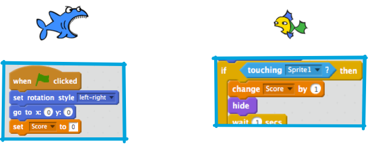

## Keeping score

To keep score, you’ll need somewhere to store the score, a way of adding to it and a way of resetting it when the game is restarted.

+ First: Storing it. Go to the **data** blocks category and click **Make a Variable**.

+ Enter `Score` as the name. 

Check out your new variable and the blocks for it!

--- collapse ---
---
title:
---

When you want to store information in a program, you use something called a variable. Think of it like a box with a label on it: you can put something in it, check what’s in it and change what’s in it. You’ll find variables under **data**, but you need to create them first! 

--- /collapse ---

Now you need to update the variable whenever a fish is eaten, and to reset it when the game is restarted. Those are both pretty easy:

+ From the **data** section, take the `Set Score to 0`{:class="blockdata"} and `Change Score by 1`{:class="blockdata"} blocks and put them into your program: 

Cool! Now you’ve got a score and everything. 

--- challenge ---

## Challenge: Winning the game

+ Pick a score at which the player wins and make something cool happen! Maybe the shark congratulates them, or a "You Win" sprite appears, or music plays or... you get the idea!

--- /challenge ---

