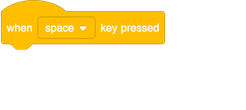
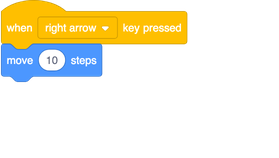
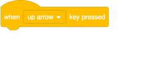
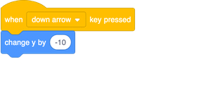
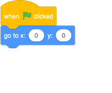

## Moving things around

Right now your parrot moves in a circle, but wouldn’t it be more fun to control it with the arrow keys? On this card, you’re going learn how to do that!

+ Start by deleting any code that you have for the parrot.

As you’ve probably guessed, you’re going to need **event** and **motion** blocks again! 

+ This time, look for this block and drag it onto the current sprite panel:

+ Click the little arrow (▼) beside `space`. You will see a list of all the keys on your keyboard that you can pick from. 

You’re going to need four of these blocks and you can connect them to **motion** blocks like this: 

**Note**: `-10` means 'go back 10 steps'.

+ Add the blocks above to your program and click the green flag to test out your code.

Your parrot moves back and forwards now, which is pretty cool, but it doesn’t move up or down. Also, if you look through the **motion** blocks, you’ll see there are no blocks for 'up' or 'down'. There are a whole bunch of them related to **x** and **y** though — let's try those!

+ Grab two `change y by`{:class="block3motion"} blocks and update your code like this: 

Now when the arrows are pressed, the parrot can move all over the stage!

--- collapse ---
---
title: How do x- and y-coordinates work?
---

When programmers need to talk about the positions of objects, like sprites, we often use **x** and **y** coordinates to describe them. The **x-axis** runs from left to right, while the **y-axis** runs from bottom to top. 

A sprite can be located by the coordinates of its centre, written for example like `(15, -27)`, where `15` is the position along the x-axis position, and `-27` the position along the y-axis.

+ To try out how this works, select a sprite and set different values for its `x` and `y` coordinates to move the sprite around the Stage.

+  Try different pairs values to see where the sprite goes! In Scratch, the x-axis goes from `-240` to `240`, and the y-axis goes from `-180` to `180`.

--- /collapse ---

### Restarting the game

The parrot moves all over the screen, but imagine this is a game: how do you restart it? You need to get the parrot back to its original location when the player starts the game. They'll start this game by clicking on the green flag, so you need to change the parrot’s `x` and `y` coordinates when that happens.

That’s actually pretty easy! The centre of the stage is `(0,0)` in `x` and `y` coordinates. 

So all you need is an **event** block for that green flag and the **go to** block from **motion**. 

+ Drag the `when green flag clicked`{:class="blockevent"} **event** block onto the current sprite panel.

+ Then find the `go to`{:class="block3motion"} **motion** block and snap it on to your flag event block.

+ Set the both the `x` and the `y` to `0` in the `go to`{:class="block3motion"} block if they are not already `0`. 

+ Now click the green flag, and you should see the parrot return to the centre of the stage.
