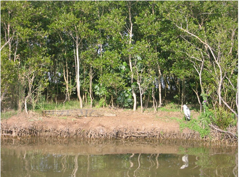

## Setting the scene

Scratch has a library of backgrounds and sprites for you to use to make your project look awesome.

+ Select the stage.


+ Click on **Backdrops**.


+ Click the icon to **Choose backdrop from library**. 


 
+ Then pick your favourite outdoor background! 



Great! Now let's turn the cat into a parrot!

+ First, select the cat and click on the **Costumes** tab 


+ Then, click on **Choose Costume from Library** 


+ Select a parrot and click **OK**. 


+ Now remove the cat costumes by selecting each of them and clicking on the **x** 


Now you have a parrot!

+ Finally, click on the **Scripts** tab again and add this code to make the parrot introduce the game:

```blocks
    when green flag pressed
    say [Hello! I need your help.] for (3) secs
    say [I need to get rid of all the mosquitos!] for (3) secs
    say [Mosquitos are small flies that spread dangerous diseases like malaria.] for (5) secs
    say [Please help me catch them and protect my friends!] for (4) secs
```