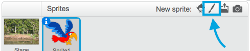

## All the sprites

Now you have a parrot that you can move around using the arrow keys. Nice! Time to add some mosquitos for it to catch!

--- task ---

Click the **New sprite** button. Scratch doesn't have any ready-made mosquito costumes, so you are going to draw one!



If your mosquito is a bit big compared to your parrot, you can use the size control to make both sprites the right size! 


Change the value in the size control to make the sprite bigger or smaller.

--- /task ---

Nice! Later, you're going to add some code to make the mosquito move around on its own, without help from the player. Your player will be the parrot, trying to catch the mosquito.

--- collapse ---
---
title: What about the backwards parrot?
---

It does look a little funny to have that parrot flying backwards. Just like you’d usually turn around rather than walking backwards, the parrot would turn around rather than flying backwards. Luckily for you, Scratch has a block for this!

The `point in direction`{:class="block3motion"} block lets you pick the direction your sprite is pointing in. You’ll find it in the **Motion** blocks section. You can type in any number of degrees, to make the sprite point wherever you like.

--- /collapse ---

--- task ---

Grab a couple of `point in direction`{:class="block3motion"} block from the **Motion** list and connect them to your parrot’s code, like this: 

```blocks3
    when [left arrow v] key pressed
+    point in direction (-90)
    move (-10) steps
```

```blocks3
    when [right arrow v] key pressed
+    point in direction (90)
    move (10) steps
```

--- /task ---

--- task ---

Since the parrot has turned around, change the direction it flys in when the left arrow is pressed:

```blocks3
    when [left arrow v] key pressed
    point in direction (-90)
+    move (10) steps
```

--- /task ---

If you tried moving the parrot around after you added the `point in direction`{:class="block3motion"} blocks, you might have noticed something a little strange happening. The parrot may not be turning quite right! 


--- collapse ---
---
title: Why does it go upside down?
---

The problem here is that the parrot sprite started, as all sprites do, with the 'all around' **rotation style**, and what you need it to have is the 'left-right' style.

As usual, there’s a block for that, and it’s in **Motion**! 

--- /collapse ---

--- task ---

Look in the **Motion** category for the block `set rotation style`{:class="block3motion"}.

Add the block to your reset code from earlier and set the rotation style to `left-right`{:class="block3motion"}, like this: 

```blocks3
    when green flag clicked
+    set rotation style [left-right v]
    go to x: (0) y: (0)
```

--- /task ---

