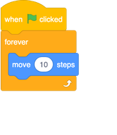
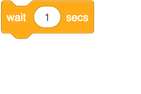
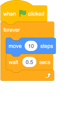
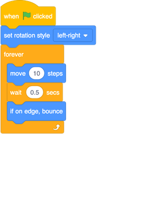
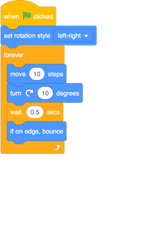
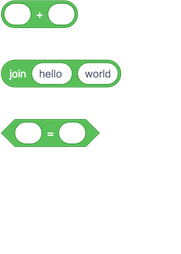
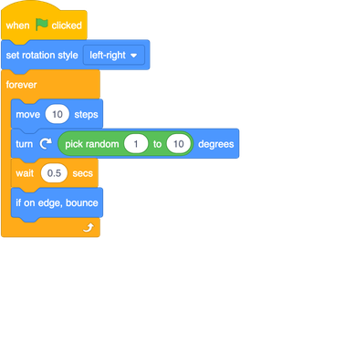

## Remote-control mosquito

Ok, now it's time to make the mosquito fly on its own. To do this, you’re going to need a new kind of block: a **control** block. 

+ Select your mosquito sprite and drag a `when green flag clicked`{:class="block3events"} **event** block, a `forever`{:class="block3control"} **control** block and a `move 10 steps`{:class="block3motion"} **motion** block into the **sprite panel** like this: 

--- collapse ---
---
title: What does the new block do?
---

**Control** blocks let you do things a certain number of times, or under certain conditions.

The mosquito does whatever is in the `forever`{:class="block3control"} block over and over again, forever. Once it has reached the end, it goes back to the top of the block and starts again. 

--- /collapse ---

+ Now click the green flag and watch what happens!

Well, that mosquito just crashed into the side of the Stage, and it was moving far too fast for your parrot to catch. 

First, you need to slow it down. That’s actually pretty easy, you just need it to wait for a little while after it moves those 10 steps. There’s a **control** block that will help you here: 

+ Snap the `wait`{:class="block3control"} block into your code, and change the number to `0.5`, like this:

--- collapse ---
---
title: Making adjustments
---

The number you set in the `wait`{:class="block3control"} block says how many **seconds** you want the mosquito to wait. `0.5` is half a second. 

You can test out different values to see which is the best for the game. Remember that you can change the number of steps too! 

--- /collapse ---

The mosquito moves now, but you need it to bounce off the edge too. Yet again, there’s a **motion** block for this! 

+ Find the `if on edge bounce`{:class="block3motion"} block, and add it in after the `wait`{:class="block3control"} block.

--- collapse ---
---
title: What does the new block do?
---

The `if on edge bounce`{:class="block3motion"} block checks if the sprite is touching the edge and, if it is, it turns left, right, up, or down as appropriate. 

--- /collapse ---

Of course, this will lead to an upside-down mosquito, so you need a `set rotation style`{:class="block3motion"} block again. 

+ Update your code to set the rotation style of the mosquito to `left-right`{:class="block3motion"}:

The mosquito moves back and forward now, but only in a straight line — a bit too easy for the player to catch with the parrot! You need to make the mosquito less foreseeable.

You already know from a previous step how to make a sprite turn, so start there! 

+ Add a turn into the mosquito’s flying and click the green flag. 

It’s better, but there’s still too much of a pattern. It needs to be more random. Luckily, Scratch can do random for you! You’ll just need a new kind of block, called an **operator** block.

--- collapse ---
---
title: What's an operator?
---

**Operators** take in one or more values (like numbers, text, true/false values) and give back a single value. You can tell the kind of value it will give back by the shape of the block: round ends give numbers or text, pointy ends give true/false. 

--- /collapse ---

+ Find the `pick random`{:class="block3operators"} **operator** block, and plug it into the `turn degrees`{:class="block3motion"} **motion** block by clicking it and dragging it into the field where you set the number of degrees. 

**Note**: you can change the minimum and maximum numbers it will pick, but the default values (`1` and `10`) are pretty good for this game, so you can just leave them.

+ Then click the green flag to run the code!
 
#### Next: catching that mosquito!

