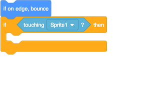
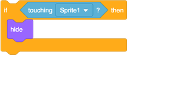
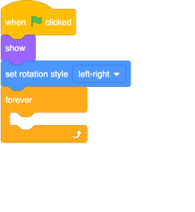
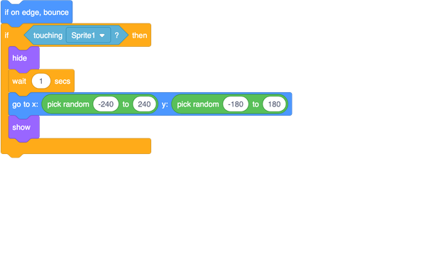

## Let's catch some flies!

The parrot moves, the mosquito flies, but they don’t interact: if the mosquito flies right into the parrot’s beak, nothing happens. Time to change that!

First, you need to know if the mosquito is touching the parrot. For this, you'll need a **control** block and a **sensing** block. 

+ Add the `if...then`{:class="block3control"} **control** block into the `forever`{:class="block3control"} loop on the mosquito, below the `if on edge bounce`{:class="block3motion"} block.

+ Drag the `touching...`{:class="block3sensing"} block into the space at the top of the `if...then`{:class="block3control"} block, and click the little triangle to pick the parrot sprite's name. If you haven’t changed it, it'll be 'Sprite1'.

--- collapse ---
---
title: How does it work?
---

The `if...then`{:class="block3control"} **control** block needs to be given a `True/False` value. 

**Sensing** blocks collect information, like where the sprite is, what it’s touching, etc. You're using the block

From this block's pointy ends, you can tell it’s going to give you the `True/False` value that the `if...then`{:class="block3control"} block needs.

--- /collapse ---

Of course, you’ve just added an `if...then`{:class="block3control"} block with no 'then'. 

You can make the mosquito disappear, as if the parrot ate it, by using the `hide`{:class="block3looks"} block.

+ Find the `hide`{:class="block3looks"} block in the **Looks** list, and put it inside `if...then`{:class="block3control"}. 

Now once the parrot catches the mosquito, it disappears for good. That’s not great. 

+ Put the `show`{:class="block3looks"} block from **Looks** in at the very start of the mosquito code, so you can reset the game. 

Better, but you don’t want the player to have to restart the game every time they catch a single mosquito! 

+ Update the code inside your `if...then`{:class="block3control"} block to look like this:

--- collapse ---
---
title: How does it work?
---

You are being clever here: when the mosquito is hidden, wait, move it, then show it again. 

It looks like lots of mosquitoes, but it’s that one sprite moving around! 

--- /collapse ---

That’s a game! But there’s no way to keep score yet...or to win. You can fix that too — on the next card!
