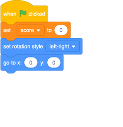
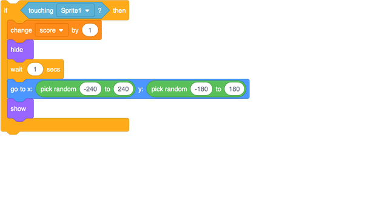
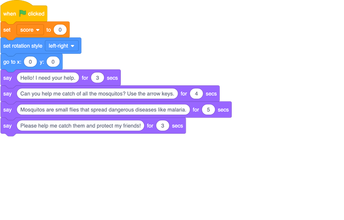

## Keeping score

To keep score, you’ll need somewhere to store the score, a way of adding to it, and a way of resetting it when the game is restarted.

+ First: storing it! Go to the **Variables** blocks category and click **Make a Variable**.

+ Enter `score` as the name. 

Check out your new variable and the blocks for it!

--- collapse ---
---
title: What are variables?
---

When you want to store information in a program, you use something called a **variable**. Think of it like a box with a label on it: you can put something in it, check what’s in it, and change what’s in it. You’ll find variables under **Variables**, but you need to create them first! 

--- /collapse ---

Now you need to update the variable whenever a mosquito is eaten, and to reset it when the game is restarted. Those are both pretty easy:

+ From the **Variables** section, take the `set [my variable v] to [0]`{:class="block3variables"} and `change [my variable v] by [1]`{:class="block3variables"} blocks. In each of the blocks, click on the little arrow and then choose `score` from the list. Then put the blocks into your program: 

### Code for the parrot

### Code for the mosquito

Cool! Now you’ve got a score and everything. 

+ Finally, and add this code to make the parrot introduce the game:

--- challenge ---

## Challenge: winning the game

+ Pick a score at which the player wins, and make something cool happen. Maybe the parrot congratulates them, or a "You win!" sprite appears, or music plays, or...you get the idea!

--- /challenge ---

