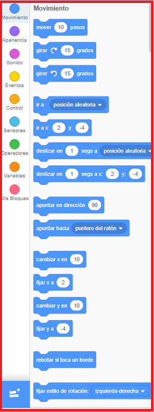

## Preparación

Una vez que abras Scratch, verás una pantalla como la de abajo.

+ Busqca cada una de las siguientes partes y recuérdelas.

### El Escenario

 

--- collapse ---
---
title: ¿Qué es el escenario?
---
Aquí es donde se ejecutan tus programas de Scratch. Tiene:

* Uno o más **fondos** \(imágenes en el fondo de la pantalla\)

* Cualquier **bloque de código** asociado a él \(ya llegaremos a esto\)

--- /collapse---

### La lista de objetos

 

--- collapse ---
---
title: ¿Qué es un objeto?
---

Cualquier objeto que vaya en el Escenario es un **objeto**.

El objeto incluye:
* La **imagen** en la escenario
* Cualquier **disfraz** \(apariencia\) alternativo que tenga
* Cualquier **sonido** asociado con él
* Cualquier **bloque de código** asociado a él 

--- /collapse ---

### La paleta de bloques de código

 

--- collapse ---
---
title: Bloques de código
---

El código en Scratch viene en forma de bloques que se conectan para crear programas. Elige los bloques de la **paleta de bloques de código**, arrastrarlos al **panel del objeto actual**, y luego conectarlos entre sí.

Hay diez categorías de bloques. Están codificados en colores, y puedes seleccionar cada categoría de la lista en la parte superior de la **paleta de bloques de código**.

--- /collapse ---

### El panel del objeto actual

 

--- collapse ---
---
title: ¿Cuál es el objeto actual?
---

El **objeto actual** es el que está seleccionado en la **lista de objetos**.

El **panel de objeto actual** es donde puedes ver el código, disfraces y sonidos para el objeto seleccionado.

--- /collapse ---

¡Es hora de empezar a programar! Vuelve a Scratch y haz clic en gato de Scratch en la lista de objetos. Ahora el gato es el objeto seleccionado.

--- task ---

Ve a la categoría **Eventos** en la **paleta de bloques de código**, haz clic en el bloque `al hacer clic en la bandera verde`{:class="block3events"} y arrástrala al **panel actual de objetos**.

```blocks3
+    when green flag clicked
```

--- /task ---

--- task ---

Luego ve a **Apariencia** en la **paleta de bloques de código** y encuentra el bloque

```blocks3
    decir [¡Hola!] durante (2) segundos
```

Arrastralo el **panel actual de objetos**, conectándolo a la parte inferior del otro bloque, así:

```blocks3
    al hacer clic en bandera verde
    decir [¡Hola!] durante (2) seg
```

--- /task ---

--- task ---

Ahora haz clic en el botón **Iniciar Programa** y ¡observa lo que sucede!

--- /task ---

