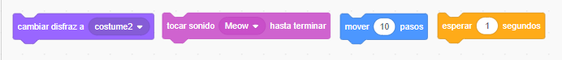
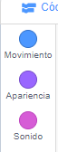
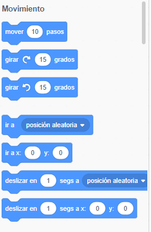
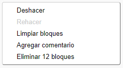

## Agregar y quitar código

¡Genial! Has escrito tu primer programa en Scratch. ¡Es hora de aprender un poco más sobre cómo mover código dentro y fuera de Scratch! El código Scratch se compone de **bloques** que se unen, como estos:



Encontrarás todos los bloques en la **paleta de bloques de código**, donde se dividen en diferentes categorías.

--- collapse ---
---
title: Usando bloques de las diferentes categorías
---

Haz clic en el nombre de una categoría para ver los bloques en esa categoría. Aquí, la categoría **Movimiento** está seleccionada.



Todos los bloques de la categoría en la que has hecho clic se muestran en una lista. Puedes elegir el que quieras, pulsa sobre él, mantén pulsado el botón del ratón, y luego simplemente arrástralo al **panel actual de objetos** y déjalo ir.

Una vez que el bloque esté en el **panel actual de objetos**, puedes moverlo y conectarlo a otros bloques.



--- /collapse ---

¡Si quieres ver lo que hace un bloque, puedes hacer doble clic en él para que se ejecute! Intenta hacer doble clic en algunos de los bloques para ver qué hacen.

--- collapse ---
---
title: Ejecutando el código
---

Por lo general, quieres que tu código se ejecute automáticamente cada vez que sucede algo específico. Es por eso que la mayoría de tus programas comenzarán con un bloque de la categoría **eventos**. La mayoría de las veces, será este:

```blocks3
    when green flag clicked
```

Los bloques de código conectados a este bloque se ejecutarán después de hacer clic en la **bandera verde**.

Los bloques de código se ejecutan de arriba hacia abajo, por lo que el orden en el cual conectas los bloques es importante. En este ejemplo, el objeto va a `decir`{:class="block3looks"} `¡Hola!` antes que `iniciar`{:class="block3sound"} el sonido `meow`{:class="block3sound"}.


```blocks3
    when green flag clicked
    decir [¡Hola!]
    tocar sonido [meow v]
```

--- /collapse ---

¡Eliminar los bloques de código que no quieras en tu programa es fácil! Simplemente arrástralos de nuevo a la paleta de bloques de código.

**Ten cuidado:** cuando arrastras un bloque en la paleta de bloques de código, todos los bloques conectados al bloque que arrastraste también serán eliminados, así que asegúrate de separar los bloques de código que deseas mantener de aquellos que deseas eliminar. Si eliminas algunos bloques de código por accidente y quieres recuperarlos puedes hacer clic con el botón derecho y luego hacer clic en la opción **deshacer** para recuperar todo.



--- task ---

¡Intenta agregar, eliminar y recuperar algunos bloques de código!

--- /task ---

### Recapitulemos

Ahora sabes cómo mover código y hacer que las cosas sucedan, tiempo para probar un programa simple: hacer que el gato de Scratch camine en un círculo.

--- task ---

Asegúrate de tener el objeto del gato seleccionado en la lista de objetos, y luego arrastra los siguientes bloques al panel de objetos y conéctalos. Los encontrarás en las listas **Eventos** y **Movimiento**.

```blocks3
+    when green flag clicked
+    move [10] steps
```

--- /task ---

--- task ---

Luego, haz clic en la bandera verde sobre el **Escenario** unas cuantas veces.


--- /task ---

Nota: Si haces clic demasiadas veces y el gato se aleja, ¡puedes arrastrarlo hacia atrás!

Deberías ver al gato andando en una línea recta...no exactamente lo que quieres, ¿verdad?

--- task ---

Conecta el bloque girar al final para hacer que el objeto gato camine en círculo. Está en la lista **Movimiento** también.

```blocks3
    when green flag clicked
    move [10] steps
+    turn cw (15) degrees
```

--- /task ---

Intenta hacer clic en la bandera verde unas cuantas veces más para ver el giro del gato en un círculo.

--- collapse ---
---
title: ¿Cómo funciona el girar?
---

Este bloque hace que el gato gire 15 grados de los 360 grados completos que forman un círculo. Puedes cambiar ese número, o el número de pasos, haciendo clic en el número y escribiendo un nuevo valor.


--- /collapse ---

--- task ---

¡Ahora guarda tu trabajo!

--- /task ---

