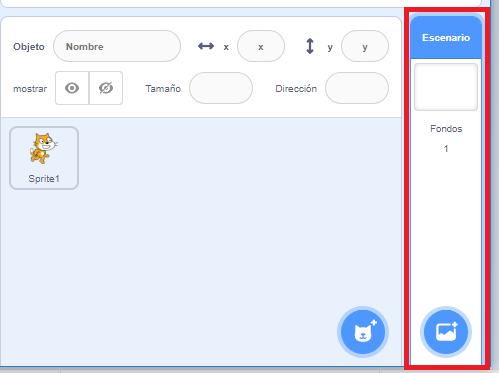
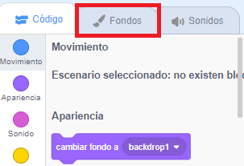
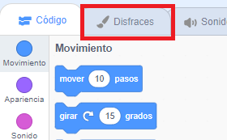
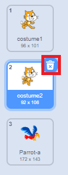

## Configurando el escenario

Scratch tiene una biblioteca de fondos y objetos que puedes usar para hacer que tu proyecto se vea genial.

--- task ---

Selecciona el escenario.

Haz clic en **Fondos**.

Haz clic en **Selecciona un fondo de la biblioteca**.

¡Luego elige tu fondo favorito al aire libre!

--- /task ---

¡Genial! ¡Ahora vamos a convertir al gato en un loro!

--- task ---

Primero, selecciona al gato y haz clic en la pestaña **Disfraces**.

Despues, haz clic en **Elegir un disfraz**

Selecciona un loro y haz clic en **Aceptar**.

Ahora elimina los disfraces del gato seleccionando cada uno de ellos y haciendo clic en la **x**.

--- /task ---

¡Genial! ¡Tienes un loro!
