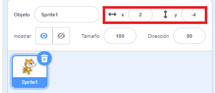

## Moviendo las cosas

En este momento el loro se mueve en un círculo, pero ¿no sería más divertido controlarlo con las teclas de flecha? En este paso, ¡aprenderás a hacerlo!

--- task ---

Empieza eliminando todo el código que tienes para el loro.

--- /task ---

Como probablemente habrás adivinado, ¡necesitarás bloques de **Evento** y **Movimiento** otra vez!


Esta vez, busca este bloque y arrástralo en el panel de objetos actuales:

```blocks3
    al presionar la tecla [espacio v]
```

Haz clic en la flecha pequeña (▼) al lado de `espacio`. Verás una lista de todas las teclas del teclado que puedes elegir.

--- task ---

Vas a necesitar cuatro de estos bloques y puedes conectarlos a **bloques de movimiento** de esta manera:

```blocks3
+    when [left arrow v] key pressed
+    move (-10) steps
```

```blocks3
+    when [right arrow v] key pressed
+    move (10) steps
```

```blocks3
+    when [up arrow v] key pressed
```

```blocks3
+    when [down arrow v] key pressed
```

--- /task ---

**Nota**:`-10` significa 'ir atrás 10 pasos'.

--- task ---

Ahora haz clic en la bandera verde y presiona las teclas de flecha para probar tu código.

--- /task ---

Tu loro se mueve hacia adelante y hacia atrás ahora, lo cual es muy bueno, pero no se mueve hacia arriba ni hacia abajo. Además, si buscas en los bloques **Movimiento**, verás que no hay bloques de 'arriba' o 'abajo'. Sin embargo, hay un montón de ellos relacionados con **x** e **y**, ¡probémoslos!

--- task ---

Toma dos bloques `cambiar y en`{:class="block3motion"}, y actualiza tu código así:

```blocks3
    when [left arrow v] key pressed
    move (-10) steps
```

```blocks3
    when [right arrow v] key pressed
    move (10) steps
```

```blocks3
    when [up arrow v] key pressed
+    change y by (10)
```

```blocks3
    when [down arrow v] key pressed
+    change y by (-10)
```

--- /task ---

Ahora, cuando se presionan las flechas, ¡el loro puede moverse por todo el escenario!

--- collapse ---
---
title: ¿Cómo funcionan las coordenadas x e y?
---

Cuando los programadores necesitan hablar sobre las posiciones de cosas, como los objetos, a menudo usamos **x** e **y** para describirlos. El **eje x** corre de izquierda a derecha, mientras que el **eje y** corre de abajo hacia arriba.


Un objeto se puede localizar por las coordenadas de su centro, por ejemplo `(15, -27)`, donde `15` es su posición a lo largo del eje x, y `-27` su posición a lo largo del eje y.

+ Para probar cómo funciona esto, selecciona un objeto y dale diferentes valores a su `x` e `y` para mover el objeto por el escenario.



+  ¡Prueba diferentes pares de valores para ver dónde va el objeto! En Scratch, el eje x va de `-240` a `240`, y el eje y va de `-180` a `180`.

--- /collapse ---

### Reiniciando el juego

El loro se mueve por toda la pantalla, pero imagina que esto es un juego: ¿cómo lo reinicias? Debes llevar al loro a su ubicación original cuando el jugador comienza el juego. Comenzarán este juego haciendo clic en la bandera verde, por lo que debes cambiar las `x` e `y` del loro cuando eso suceda.

¡Hacer esto es muy fácil! El centro del escenario es `(0,0)` en coordenadas `x` e `y`.

Así que todo lo que necesitas es un bloque **Eventos** para la bandera verde, y el bloque **ir a** de la categoría **Movimiento**.

--- task ---

Arrastra un bloque `al hacer clic en bandera verde`{:class="block3events"} de la categoría **Eventos** al panel de objeto actual.

```blocks3
+    when green flag clicked
```

Luego encuentra el bloque `ir a`{:class="block3motion"} en la categoría **Movimiento**, y arrástralo debajo del bloque de la bandera de la categoría Eventos.

```blocks3
    when green flag clicked
+    go to x: (0) y: (0)
```

Establece las coordenadas `x` e `y` en `0` en el bloque `ir a`{:class="block3motion"} si su valor actual no es `0`.

--- /task ---

--- task ---

 Ahora haz clic en la bandera verde y veras al loro regresar al centro del escenario.

--- /task ---
