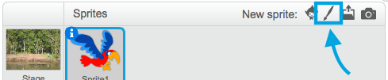

## Todos los objetos

Ahora tienes un loro que puedes mover usando las teclas de flecha. ¡Bien! ¡Es hora de agregar algunos mosquitos para que los atrape!

--- task ---

Haz clic en el botón **Elegir un objeto**. Scratch no tiene disfraces de mosquitos confeccionados, ¡así que vas a dibujar uno!



Si tu mosquito es un poco grande en comparación con tu loro, puedes usar el control de tamaño para hacer que ambos objetos tengan el tamaño correcto!


Cambia el número en el control de tamaño para hacer que el objeto sea mayor o menor.

--- /task ---

¡Bien! Más tarde, agregará un código para que el mosquito se mueva por sí solo, sin la ayuda del jugador. Tu jugador será el loro, tratando de atrapar al mosquito.

--- collapse ---
---
título: ¿Qué pasa con el loro al revés?
---

Parece un poco extraño tener a ese loro volando hacia atrás. Al igual que normalmente se da la vuelta en lugar de caminar hacia atrás, el loro se da la vuelta en lugar de volar hacia atrás. Por suerte, ¡Scratch tiene un bloque para hacer esto!

El bloque `apuntar en dirección`{:class="block3motion"} te permite elegir la dirección en la que apunta tu objeto. Lo encontrarás en la sección de bloques **Movimiento**. Puedes escribir cualquier número de grados, para hacer que el objeto apunte a donde quieras.

--- /collapse ---

--- task ---

Arrastra un par de bloques `apuntar en dirección`{:class="block3motion"} desde la lista **Movimiento** y conéctalos al código de tu loro, así:

```blocks3
    when [left arrow v] key pressed
+    point in direction (-90)
    move (-10) steps
```

```blocks3
    when [right arrow v] key pressed
+    point in direction (90)
    move (10) steps
```

--- /task ---

--- task ---

Dado que el loro se ha dado la vuelta, cambia la dirección en la que vuela cuando se presiona la flecha izquierda:

```blocks3
    when [left arrow v] key pressed
    point in direction (-90)
+    move (10) steps
```

--- /task ---

Si intentaste mover el loro después de agregar el `en los`{:class="block3motion"}, es posible que hayas notado que está sucediendo algo un poco extraño. ¡Es posible que el loro no esté girando bien!


--- collapse ---
---
title: ¿Por qué va al revés?
---

El problema está en que el objeto loro comenzó, como hacen todos los objetos, con el **estilo de rotación** 'en todas direcciones', y lo que necesitas es el estilo 'izquierda-derecha'.

Como de costumbre, hay un bloque para eso, ¡y está en la categoría **Movimiento**!

--- /collapse ---

--- task ---

Busca en la categoría **Movimiento** el bloque `fijar estilo de rotación a` {:class="block3motion"}.

Añade el bloque a tu código de inicio del loro, y establece el estilo de rotación a `izquierda-derecha`{:class="block3motion"}, así:

```blocks3
    when green flag clicked
+    set rotation style [left-right v]
    go to x: (0) y: (0)
```

--- /task ---

