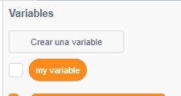
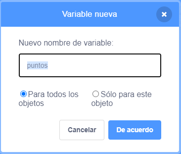

## Guardando la puntuación

Para llevar la puntuación, necesitarás un lugar para almacenar la puntuación, una forma de agregarla y una forma de restablecerla cuando se reinicia el juego.

--- task ---

Primero: ¡almacenarlo! Ve a la categoría de bloques **Variables** y haz clic en **Crear una variable**.



Introduce `puntos` como nombre.



¡Mira tu nueva variable y los bloques que tiene!


--- /task ---

--- collapse ---
---
title: ¿Qué son las variables?
---

Cuando quieres almacenar información en un programa, se usa algo llamado **variable**. Piensa en ello como una caja con una etiqueta: puedes poner algo en ella, comprobar qué hay en ella y cambiar lo que hay en ella. Encontrarás variables en **Variables**, ¡pero necesitas crearlas primero!

--- /collapse ---

Ahora necesitas actualizar la variable cada vez que el loro se come un mosquito y restablecerla cuando se reinicia el juego:

--- task ---

--- /task ---

De la sección **variables**, pon `conjunto [mi variable v] a [0]`{:class "block3variables"} y `cambia [mi variable v] por [1]`{:class="block3variables"} bloques. En cada uno de los bloques, haz clic en la flecha pequeña y luego elige `puntos` de la lista. Luego pon los bloques en tu programa:

--- task ---

### Código para el loro

```blocks3
    when green flag clicked
+    set [puntos v] to [0]
    set rotation style [left-right v]
    go to x: (0) y: (0)
```

### Código para el mosquito

```blocks3
    if <touching [Sprite1 v] ?> then
+        change [puntos v] by [1]
        hide
        wait (1) secs
        go to x: (pick random (-240) to (240)) y: (pick random (-180) to (180))
        show
    end
```

--- /task ---

¡Genial! Ahora tienes puntuación y todo.

--- task ---

Finalmente, añade este código para hacer que el loro introduzca el juego:

```blocks3
when green flag clicked
    set [score v] to [0]
    set rotation style [left-right v]
    go to x: (0) y: (0)
    say [Hello! I need your help.] for (3) secs
    say [Can you help me catch of all the mosquitos? Use the arrow keys.] for (4) secs
    say [Mosquitos are small flies that spread dangerous diseases like malaria.] for (5) secs
    say [Please help me catch them and protect my friends!] for (3) secs


    al hacer clic en bandera verde
    set [puntos v] to [0]
    set rotation style [left-right v]
    go to x: (0) y: (0)
    say [¡Hola! Necesito tu ayuda.] for (3) secs
    say [¿Puedes ayudarme a atrapar todos los mosquitos? Usa las teclas de flecha.] for (4) secs
    say [Los mosquitos son insectos pequeñas que propagan enfermedades peligrosas como la malaria.] for (5) secs
    say [¡Por favor ayúdame a atraparlos y proteger a mis amigos!] for (3) secs
```

--- /task ---
