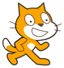

## Mise en place

Une fois que tu as ouvert Scratch, tu verras un écran comme celui ci-dessous.

+ Recherche chacune des parties suivantes et rappelle-toi où elles se trouvent.

### La scène

 

--- collapse ---
---
title: Qu'est-ce que la scène ?
---
C’est là que tes programmes Scratch sont exécutés. Il y a :

* Un ou plusieurs **arrière-plans** (images sur l'arrière-plan de l'écran)

* Tous les **blocs de code** qui y sont associés (nous y reviendrons)

--- /collapse ---

### La liste des sprites

 

--- collapse ---
---
title: Qu'est-ce qu'un sprite ?
---

Tout objet qui va sur la scène est un **sprite**.

Le sprite comprend :
* L' **image** sur la scène
* Tout **costume** (apparence) supplémentaire qu'il possède
* Tous les **sons** qui y sont associés
* Tous les **blocs de code** qui y sont associés 

--- /collapse ---

### La palette des blocs de code

 

--- collapse ---
---
title: Blocs de code
---

Le code dans Scratch se présente sous la forme de blocs que tu relies pour créer des programmes. Tu choisis des blocs dans la palette **blocs de code**, fais-les glisser dans le panneau **sprite actuel**, puis connecte-les.

Il existe neuf catégories de blocs. Ils sont codés par couleur, et tu peux sélectionner chaque catégorie dans la liste en haut de la **palette de blocs de code**.

--- /collapse ---

### Le panneau du sprite actuel

 

--- collapse ---
---
title: Qu'est-ce que le sprite actuel ?
---

Le **sprite actuel** est celui qui est sélectionné dans la **liste des sprites**.

Le **panneau du sprite actuel** te permet de voir le code, les costumes, et les sons du sprite sélectionné.

--- /collapse ---

Il est temps de coder ! Retourne sur Scratch et clique sur le chat Scratch dans la liste des sprites. Le chat est maintenant le sprite actuel.

--- task ---

Va à la catégorie **Évènements** dans la palette **blocs de code**, clique sur le bloc `quand le drapeau vert est cliqué`{:class="block3events"} et glisse-le sur le **panneau de sprite actuel**.

```blocks3
+    when green flag clicked
```

--- /task ---

--- task ---

Puis va dans **Apparence** dans la palette **de blocs de code** et trouve le bloc

```blocks3
    dire [Bonjour !] pendant (2) secondes
```

Glisse-le sur le **panneau de sprite actuel**, en le connectant en bas de l'autre bloc, comme ceci :

```blocks3
    quand le drapeau vert est cliqué
    dire [Bonjour !] pendant (2) secondes
```

--- /task ---

--- task ---

Maintenant, clique sur le bouton **Commencer** et regarde ce qu'il se passe !

--- /task ---

