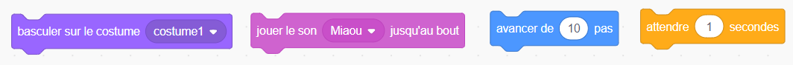
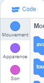
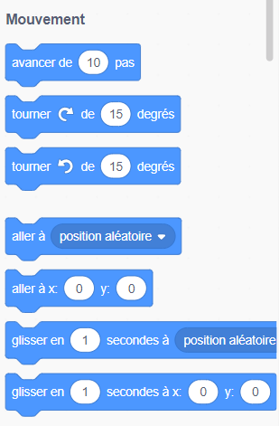
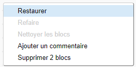

## Ajouter et supprimer du code

Super ! Tu as écrit ton premier programme Scratch. Il est temps d'en apprendre un peu plus sur l'ajout et la suppression de code dans Scratch ! Le code Scratch est composé de **blocs** que tu assembles ensemble, tels que ceux-ci :



Tu trouveras tous les blocs dans la **palette de blocs de code**, où ils sont répartis en différentes catégories.

--- collapse ---
---
title: Utilisation de blocs de différentes catégories
---

Clique sur un nom de catégorie pour voir les blocs dans cette catégorie. Ici, la catégorie **Mouvement** est sélectionnée.



Tous les blocs de la catégorie sélectionnée sont affichés dans une liste. Tu peux choisir celui que tu veux, clique dessus, maintiens le bouton de la souris, puis fais-le glisser sur le **panneau de sprite actuel** et relâche-le.

Une fois que le bloc est dans le ** panneau de sprite actuel**, tu peux le déplacer et le connecter à d'autres blocs.



--- /collapse ---

Si tu veux voir ce que fait un bloc, tu peux double-cliquer dessus pour l'exécuter ! Essaie de double-cliquer sur certains blocs pour voir ce qu’ils font.

--- collapse ---
---
title: Exécuter le code
---

Normalement, tu veux que tes blocs s'exécutent automatiquement chaque fois que quelque chose de spécifique se produit. C'est pourquoi la plupart de tes programmes commenceront par un bloc de la catégorie **événements**. Le plus souvent, ce sera celui-ci :

```blocks3
    when green flag clicked
```

Les blocs de code reliés à ce bloc seront exécutés après que le **drapeau vert** sera cliqué.

Les blocs de code s'exécutent de haut en bas, donc l'ordre dans lequel tu relies ton code est important. Dans cet exemple, le sprite `dire`{:class="block3looks"} `Bonjour !`{:class="block3looks"} avant qu'il `ne joue`{:class="block3sound"} le son `miaou`{:class="block3sound"}.


```blocks3
    quand le drapeau vert est cliqué
    dire [Bonjour !]
    jouer le son [miaou v]
```

--- /collapse ---

Il est facile d'enlever ou de supprimer des blocs de code que tu ne veux pas dans ton programme ! Fais-les simplement glisser dans la palette des blocs de code.

**Attention :** quand tu fais glisser un bloc dans la palette de blocs de code, tous les blocs connectés au bloc que tu fais glisser seront également supprimés, alors assure-toi de séparer les blocs de code que tu veux garder de ceux que tu veux retirer. Si tu supprimes des blocs de code par accident et que tu veux les récupérer, tu peux faire un clic droit puis cliquer sur l'option **annuler** pour tout récupérer.



--- task ---

Essaie d'ajouter, de supprimer, et d'annuler la suppression de certains blocs de code !

--- /task ---

### Les assembler

Maintenant que tu sais comment déplacer le code et les exécuter, il est temps d'essayer un programme simple : faire marcher le chat Scratch en cercle.

--- task ---

Assure-toi que le chat est sélectionné dans la liste des sprites et fais glisser les blocs suivants ensemble. Tu les trouveras dans les listes **Événements** et **Mouvement**.

```blocks3
+    when green flag clicked
+    move [10] steps
```

--- /task ---

--- task ---

Ensuite, clique plusieurs fois sur le drapeau vert au-dessus de la **Scène**.


--- /task ---

Remarque : si tu cliques trop souvent sur le drapeau et que le chat s'éloigne, tu peux le faire glisser !

Tu devrais voir le chat marcher en ligne droite... ce n'est pas exactement ce que tu veux, exact ?

--- task ---

Assemble le bloc tourner à la fin pour faire marcher le sprite du chat en cercle. Il se trouve aussi dans la liste **Mouvement**.

```blocks3
    when green flag clicked
    move [10] steps
+    turn cw (15) degrees
```

--- /task ---

Essaie de cliquer sur le drapeau vert plusieurs fois pour voir le chat tourner en cercle.

--- collapse ---
---
title: Comment fonctionne la rotation ?
---

Ce bloc fait tourner le chat de 15 degrés sur 360 degrés qui forment un cercle. Tu peux modifier ce nombre ou le nombre d'étapes en cliquant sur le numéro et en tapant une nouvelle valeur.


--- /collapse ---

--- task ---

Maintenant, enregistre ton travail !

--- /task ---

