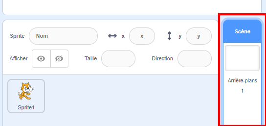
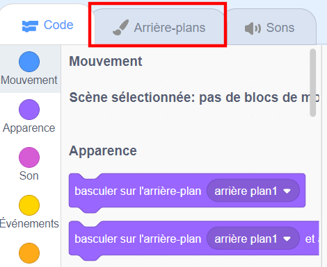
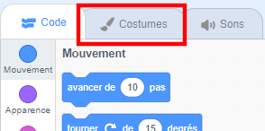
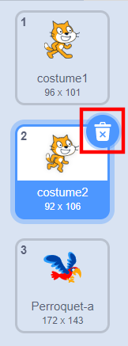

## Préparer la scène

Scratch dispose d'une bibliothèque d'arrière-plans et de sprites que tu peux utiliser pour embellir ton projet.

--- task ---

Sélectionne la scène.

Clique sur **Arrière-plans**.

Clique sur l'icône pour **Choisir un arrière-plan à partir de la bibliothèque**.

Puis choisis ton arrière-plan de paysage extérieur préféré !

--- /task ---

Génial ! Maintenant, transformons le chat en perroquet !

--- task ---

Tout d'abord, sélectionne le chat et clique sur l'onglet **Costumes**.

Ensuite, clique sur **Choisir un costume à partir de la bibliothèque**

Sélectionne un perroquet et clique sur **OK**.

Maintenant, supprime les costumes du chat en sélectionnant chacun d'eux et en cliquant sur le **x**.

--- /task ---

Super ! Tu as un perroquet !
