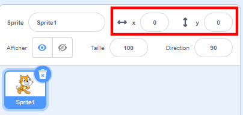

## Déplacer des objets

En ce moment, ton perroquet se déplace en cercle, mais ne serait-il pas plus amusant de le contrôler avec les touches fléchées ? Dans cette étape, tu vas apprendre comment faire cela !

--- task ---

Commence par supprimer tout le code que tu as pour le perroquet.

--- /task ---

Comme tu l'as probablement deviné, tu auras besoin de blocs **événement** et **mouvement** à nouveau !


Cette fois-ci, cherche ce bloc et fais-le glisser sur le panneau de sprite actuel :

```blocks3
    when [space v] key pressed
```

Clique sur la petite flèche (▼) à côté de `espace`. Tu verras une liste de toutes les touches de ton clavier que tu peux choisir.

--- task ---

Tu auras besoin de quatre de ces blocs et tu peux les connecter à des blocs de **mouvement** comme ceci :

```blocks3
+    when [left arrow v] key pressed
+    move (-10) steps
```

```blocks3
+    when [right arrow v] key pressed
+    move (10) steps
```

```blocks3
+    when [up arrow v] key pressed
```

```blocks3
+    when [down arrow v] key pressed
```

--- /task ---

**Remarque** : `-10` signifie « reculer de 10 pas ».

--- task ---

Maintenant, clique sur le drapeau vert et appuie sur les touches fléchées pour tester ton code.

--- /task ---

Ton perroquet recule en arrière et avance maintenant, ce qui est plutôt cool, mais il ne bouge pas vers le haut ou vers le bas. Aussi, si tu regardes les blocs **mouvement** , tu verras qu'il n'y a pas de blocs pour « haut » ou « bas ». Il y a tout un tas de choses liées à **x** et **y** — essayons-les !

--- task ---

Récupère deux blocs `ajouter ... à y`{:class="block3motion"} et mets à jour ton code comme ceci :

```blocks3
    when [left arrow v] key pressed
    move (-10) steps
```

```blocks3
    when [right arrow v] key pressed
    move (10) steps
```

```blocks3
    when [up arrow v] key pressed
+    change y by (10)
```

```blocks3
    when [down arrow v] key pressed
+    change y by (-10)
```

--- /task ---

Maintenant lorsque les flèches sont enfoncées, le perroquet peut se déplacer sur toute la scène !

--- collapse ---
---
title: Comment fonctionnent les coordonnées x et y ?
---

Lorsque les programmeurs ont besoin de parler des positions des objets, comme les sprites, nous utilisons souvent les coordonnées **x** et **y** pour les décrire. L' **axe x** va de gauche à droite, tandis que l'axe **y** va de bas en haut.


Un sprite peut être localisé par les coordonnées de son centre, écrit par exemple `(15, -27)`, où `15` est la position le long de la position de l'axe X, et `-27` la position le long de l'axe y.

+ Pour essayer comment cela fonctionne, sélectionne un sprite et définis des valeurs différentes pour ses coordonnées `x` et `y` pour déplacer le sprite sur la scène.



+  Essaie différentes paires de valeurs pour voir où va le sprite ! Dans Scratch, l'axe x va de `-240` à `240`, et l'axe y va de `-180` à `180`.

--- /collapse ---

### Redémarrer le jeu

Le perroquet se déplace sur l'écran, mais imagine que c'est un jeu : comment le redémarrer ? Tu devras récupérer le perroquet à son emplacement d'origine lorsque le joueur commence la partie. Ils commenceront ce jeu en cliquant sur le drapeau vert, donc tu dois modifier les coordonnées `x` et `y` du perroquet lorsque cela se produit.

C'est en fait assez facile ! Le centre de la scène est `(0,0)` en coordonnées `x` et `y`.

Donc tout ce dont tu as besoin est d'un bloc **événement** pour ce drapeau vert et le bloc **aller à** de **mouvement**.

--- task ---

Fais glisser le bloc `quand le drapeau vert est cliqué`{:class="blockevent"} de **événement** sur le panneau de sprite actuel.

```blocks3
+    when green flag clicked
```

Puis trouve le bloc `aller à`{:class="block3motion"} de **mouvement** et assemble-le au bloc événement de ton drapeau.

```blocks3
    when green flag clicked
+    go to x: (0) y: (0)
```

Mets `x` et `y` à `0` dans le bloc `aller à`{:class="block3motion"} s'ils ne sont pas déjà à `0`.

--- /task ---

--- task ---

 Clique maintenant sur le drapeau vert, et tu devrais voir le perroquet revenir au centre de la scène.

--- /task ---
