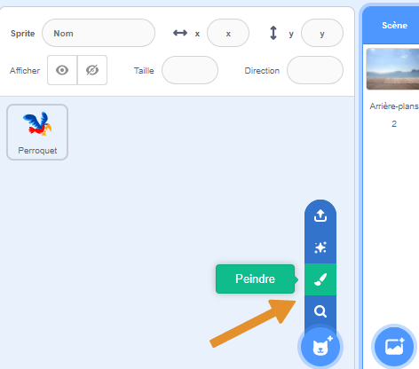
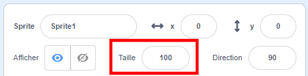
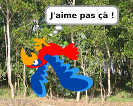

## Tous les sprites

Maintenant tu as un perroquet que tu peux déplacer en utilisant les touches fléchées. Super ! Il est temps d'ajouter quelques moustiques à attraper !

--- task ---

Clique sur le bouton **Nouveau sprite**. Scratch n'a pas de costume de moustique tout prêt, donc tu vas en dessiner un !



Si ton moustique est un peu gros par rapport à ton perroquet, tu peux utiliser le contrôle de taille pour que les deux sprites aient la bonne taille !



Modifie la valeur dans le contrôle de taille pour rendre le sprite plus grand ou plus petit.

--- /task ---

Super ! Plus tard, tu vas ajouter du code pour faire bouger le moustique tout seul, sans l'aide du joueur. Ton joueur sera le perroquet, essayant d'attraper le moustique.

--- collapse ---
---
title: Et le perroquet à l'envers ?
---

Ça fait bizarre de voir ce perroquet voler en arrière. Comme tu le ferais en général plutôt que de marcher en arrière, le perroquet se retournerait plutôt que de voler en arrière. Heureusement pour toi, Scratch a un bloc pour cela !

Le bloc `s'orienter vers`{:class="block3motion"} nous permet de choisir la direction dans laquelle ton sprite est s'oriente. Tu le trouveras dans la section des blocs **Mouvement**. Tu peux taper n'importe quel nombre de degrés, pour orienter le sprite où tu le souhaites.

--- /collapse ---

--- task ---

Prends quelques copies du bloc `s'orienter vers`{:class="block3motion"} de la liste **Mouvement** et connecte-les au code de ton perroquet, comme suit :

```blocks3
    when [left arrow v] key pressed
+    point in direction (-90)
    move (-10) steps
```

```blocks3
    when [right arrow v] key pressed
+    point in direction (90)
    move (10) steps
```

--- /task ---

--- task ---

Puisque le perroquet s'est retourné, change la direction dans laquelle il vole lorsque la flèche de gauche est pressée :

```blocks3
    when [left arrow v] key pressed
    point in direction (-90)
+    move (10) steps
```

--- /task ---

Si tu essaies de déplacer le perroquet après avoir ajouté les blocs `s'orienter vers`{:class="block3motion"}, tu auras surement remarqué quelque chose d'un peu étrange. Le perroquet ne tourne peut-être pas très bien !



--- collapse ---
---
title: Pourquoi il se retourne ?
---

Le problème ici est que le sprite perroquet a commencé, comme tous les sprites le font, avec le **sens de rotation** « 360° » et ce dont tu as besoin est le style « gauche-droite ».

Comme d'habitude, il existe un bloc pour cela, et c'est dans **Mouvement** !

--- /collapse ---

--- task ---

Recherche dans la catégorie **Mouvement** le bloc`fixer le sens de rotation`{:class="block3motion"}.

Ajoute le bloc à ton code de réinitialisation plus tôt et fixe le sens de rotation sur `gauche-droite`{:class="block3motion"}, comme ceci :

```blocks3
    when green flag clicked
+    set rotation style [left-right v]
    go to x: (0) y: (0)
```

--- /task ---

