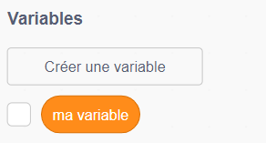
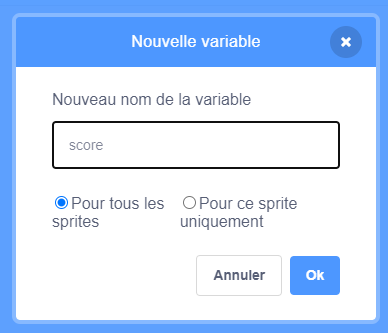
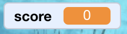

## Garder le score

Pour garder le score, tu auras besoin d'un endroit pour stocker le score, un moyen de l'ajouter, et un moyen de le réinitialiser lorsque le jeu est redémarré.

--- task ---

Tout d'abord, stocke-le ! Va dans la catégorie du bloc **Variables** et clique sur **Créer une Variable**.



Entre `score` comme nom.



Vérifie ta nouvelle variable et les blocs correspondants !



--- /task ---

--- collapse ---
---
title: Que sont les variables ?
---

Lorsque tu souhaites stocker des informations dans un programme, tu utilises quelque chose appelé **variable**. Penses-y comme à une boîte avec une étiquette: tu peux y insérer quelque chose, vérifier son contenu et en changer le contenu. Tu trouveras des variables sous **Variables**, mais tu dois d'abord les créer !

--- /collapse ---

Maintenant tu dois mettre à jour la variable chaque fois qu'un moustique est mangé, et la réinitialiser lorsque le jeu est redémarré :

--- task ---

--- /task ---

Dans la section **Variables** , prend le `définir [ma variable v] à [0]`{:class="block3variables"} et `ajouter [1] à [ma variable v]`{:class ="block3variables"}. Dans chacun des blocs, clique sur la petite flèche puis choisis `score` dans la liste. Puis mets les blocs dans ton programme :

--- task ---

### Code pour le perroquet

```blocks3
    when green flag clicked
+    set [score v] to [0]
    set rotation style [left-right v]
    go to x: (0) y: (0)
```

### Code pour le moustique

```blocks3
    si <touching [Sprite1 v] ?> alors
+ ajouter [1] à [score v]
        cacher
        attendre (1) secondes
        aller à x: (nombre aléatoire entre (-240) et (240)) y: (nombre aléatoire entre (-180) et (180) )
        montrer
    fin
```

--- /task ---

Cool ! Maintenant, tu as un score et tout.

--- task ---

Enfin, ajoutez ce code pour que le perroquet présente le jeu :

```blocks3
    quand le drapeau vert est cliqué
    mettre [score v] à [0]
    fixer le sens de rotation [gauche-droite v]
    aller à x: (0) y: (0)
    dire [Bonjour ! J'ai besoin de ton aide.] pendant (3) secondes
    dire [Peux-tu m'aider à attraper tous les moustiques ? Utilise les touches fléchées.] pendant (4) secondes
    dire [Les moustiques sont de petites mouches qui propagent des maladies dangereuses comme le paludisme. pendant (5) secondes
    dire [Aide-moi à les attraper et à protéger mes amis !] pendant (3) secondes
```

--- /task ---
