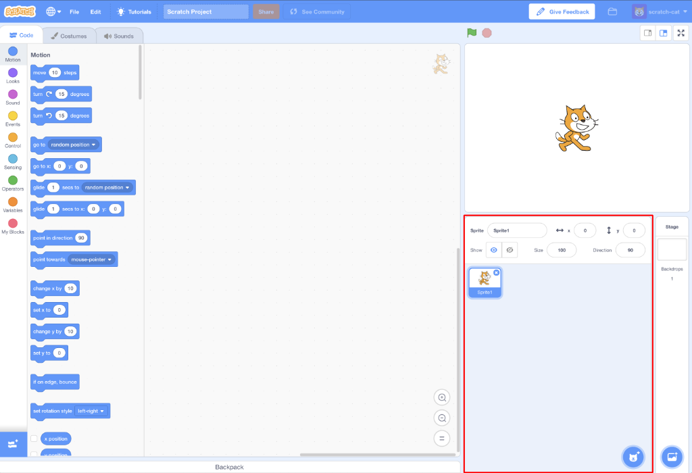
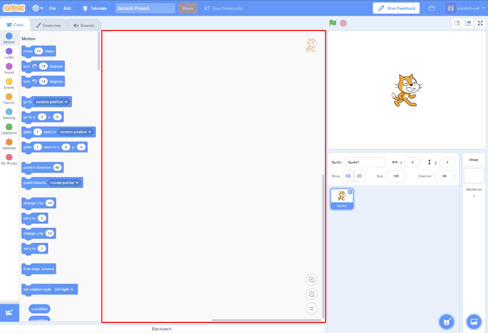

## शुरू करने के लिए

एक बार जब आप Scratch खोलते हैं, तो आपको नीचे की तरह एक स्क्रीन दिखाई देगी।

+ निम्नलिखित भागों को ढूंढें और उन्हें याद रखें।

### स्टेज

 

--- collapse ---
---
title: स्टेज क्या है?
---
यहीं पर आपके Scratch प्रोग्राम चलता है। इसमें यह होता है:

* एक या अधिक **backgrounds** \(स्क्रीन की पृष्ठभूमि या बैकग्राउंड पर चित्र\)

* इससे संबंधित कोई भी **code ब्लॉक्स** \(हम इसके बारे में निचे चर्चा करेंगे\)

--- /collapse ---

### Sprites की सूची

 

--- collapse ---
---
title: sprite क्या होता है?
---

स्टेज पर जाने वाली कोई भी वस्तु **Sprite** (स्प्राइट) कहलाता है।

Sprite में शामिल हैं:
* स्टेज पर **छवि** (image)
* उसके कोई भी विकल्प **costumes** \(पोशाक\)
* इससे जुड़ी कोई भी **sounds** (आवाज़)
* इससे जुड़ा कोई भी **code blocks** (कोड ब्लॉक) 

--- /collapse ---

### कोड ब्लॉक्स की जगह

 

--- collapse ---
---
title: कोड ब्लॉक्स
---

Scratch में कोड उन ब्लॉकों के रूप में आता है जिन्हें आप जोड़कर प्रोग्राम बना सकते हैं। आप ब्लॉक्स **code blocks palette** (ब्लॉक्स की जगह) से चुनते है, उन्हें **current sprite panel** (वर्तमान स्प्राइट पैनल) में खींचते हैं, और फिर उन्हें एक दूसरे से जोड़ते हैं।

ब्लॉक की दस श्रेणियां हैं। वे रंग से दर्शाए हैं, और आप **code blocks palette** के ऊपर दिए आइटम के सूची में से क्लिक करके उनके बीच चयन कर सकते हैं।

--- /collapse ---

### वर्तमान sprite पैनल (current sprite panel)

 

--- collapse ---
---
title: वर्तमान sprite क्या होता है?
---

**वर्तमान sprite** वह है जिसे **sprite सूची** (list) में से चुना गया है।

**वर्तमान sprite पैनल** वह स्थान है जहाँ आप चुनें गए स्प्राइट के कोड, वेशभूषा और ध्वनियाँ (code, costumes, and sounds) देख सकते हैं।

--- /collapse ---

कोडिंग करने का समय! Scratch पर वापस जाएं और sprite सूची में Scratch बिल्ली (cat) पर क्लिक करें। अब बिल्ली वर्तमान sprite है।

--- task ---

**कोड ब्लॉक्स** में **Events** श्रेणी में, `when flag clicked`{:class="block3events"} ब्लॉक पर क्लिक करें और इसे **वर्तमान sprite पैनल** में खींचें।

```blocks3
+    when green flag clicked
```

--- /task ---

--- task ---

फिर **code blocks palette** में **Looks** श्रेणी पर जाएं और इस ब्लॉक को खोजें

```blocks3
    say [Hello!] for (2) secs
```

इसे **वर्तमान sprite पैनल** पर खींचें और इसे अन्य ब्लॉक के नीचे से जोड़ें, इस तरह:

```blocks3
    when green flag clicked
    say [Hello!] for (2) secs
```

--- /task ---

--- task ---

अब **Start Program** बटन पर क्लिक करें और देखें क्या होता है!

--- /task ---

