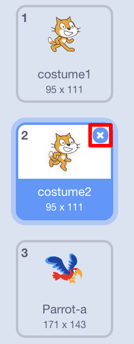

## दृश्य की स्थापना

Scratch में बैकड्रॉप और sprite का एक लाइब्रेरी (library) होता है जिसका इस्तमाल करके आप अपने प्रोजेक्ट को कमाल का दिखाई दे सकते हैं ।

--- task ---

स्टेज को चुनना।

**Backdrops** पर क्लिक करें।

**Choose backdrop from library** आइकन पर क्लिक करें।

फिर अपनी पसंदीदा घर के बाहर की बैकड्रॉप चुनें!

--- /task ---

शानदार! अब बिल्ली को एक तोते में बदल दें!

--- task ---

सबसे पहले, बिल्ली पर क्लिक करें और फिर **Costumes** टैब पर क्लिक करें।

फिर, **Choose costume from Library** पर क्लिक करें

तोते को चुने और **OK** क्लिक करें।

अब उनमें से प्रत्येक को चुने और **x** पर क्लिक करके बिल्ली की वेशभूषा (costume) को हटा दें।

--- /task ---

शानदार! अब आपके पास एक तोता है!
