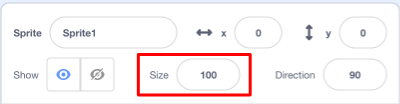
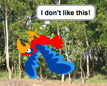

## सभी स्प्राइट्स (sprites)

अब आपके पास एक तोता है जिसे आप तीर कुंजियों का उपयोग करके घुमा सकते हैं। सुंदर! समय आ गया है कि आप कुछ मच्छरों को जोड़े जिसे आपका तोता पकड़ सकें।

--- task ---

**New sprite** बटन पर क्लिक करें। Scratch के पास कोई भी तैयार मच्छर वेशभूषा नहीं है, इसलिए आप एक आकर्षित करने जा रहे हैं!


यदि आपकी मच्छर आपके तोते की तुलना में थोड़ा बड़ा है, तो आप दोनों को सही आकार में बनाने के लिए आकार नियंत्रण का उपयोग कर सकते हैं!



स्प्राइट को बड़ा या छोटा करने के लिए आकार नियंत्रण में संख्या बदलें।

--- /task ---

सुंदर! बाद में, आप कुछ कोड जोड़ेंगे ताकि खिलाड़ी की मदद के बिना मच्छर अपने आप ही घूम सके। आपका खिलाड़ी तोता होगा, मच्छर को पकड़ने की कोशिश करेगा।

--- collapse ---
---
title: पीछे के तोते के बारे में क्या?
---

उस तोते को पीछे की तरफ उड़ते हुए देखना थोड़ा मज़ेदार लगता है। जैसे आप आमतौर पर पीछे की ओर चलने के बजाय मुड़ते हैं, वैसे ही तोता पीछे की ओर उड़ने के बजाय मुड़ता है। सौभाग्य से आपके लिए, Scratch में इसके लिए एक ब्लॉक है!

`point in direction`{:class="block3motion"} ब्लॉक आपको उस दिशा को चुनने देता है जिसे आपका स्प्राइट देख कर रहा है। आप इसे **Motion** ब्लॉक्स की श्रेणी में ढूंढ सकते हैं। कोई भी संख्या को डिग्री में टाइप करके, आप अपने स्प्राइट को जहां चाहे वहां इंगित कर सकते हैं।

--- /collapse ---

--- task ---

**Motion** श्रेणी में से कुछ `point in direction`{:class="block3motion"} ब्लॉक को पकड़े और उन्हें तोते के कोड से जोड़ें, कुछ इस तरह:

```blocks3
    when [left arrow v] key pressed
+    point in direction (-90)
    move (-10) steps
```

```blocks3
    when [right arrow v] key pressed
+    point in direction (90)
    move (10) steps
```

--- /task ---

--- task ---

जब से तोता मूड गया है, तब बाएं तीर कुंजी दबाए जाने पर उसके उड़ने की दिशा बदल दे:

```blocks3
    when [left arrow v] key pressed
    point in direction (-90)
+    move (10) steps
```

--- /task ---

यदि आपने `point in direction`{:class="block3motion"} ब्लॉक को जोड़ने के बाद तोते को अब चारों ओर ले जाने का प्रयास किया है, तोह आपको कुछ अजीब सा होते हुए दिखाई देगा। तोता काफी सही से मुड नहीं रहा है!



--- collapse ---
---
title: यह उल्टा क्यों होता है?
---

यहां समस्या यह है कि तोता sprite की शुरुआत हुई, जैसा कि सभी स्प्राइट करते हैं, 'सभी के चारों ओर' **rotation style**, और जो आपके पास होना चाहिए वह 'बाएं-दाएँ' (left-right) शैली है।

हमेशा की तरह, उसके लिए एक ब्लॉक है, और यह **Motion** में है!

--- /collapse ---

--- task ---

`set rotation style`{:class="block3motion"} ब्लॉक को **Motion** श्रेणी में ढूंढ़े।

ब्लॉक को पहले के अपने रीसेट कोड में जोड़ें और रोटेशन शैली को `left-right`{:class="block3motion"} पर सेट करें, जैसे:

```blocks3
    when green flag clicked
+    set rotation style [left-right v]
    go to x: (0) y: (0)
```

--- /task ---

