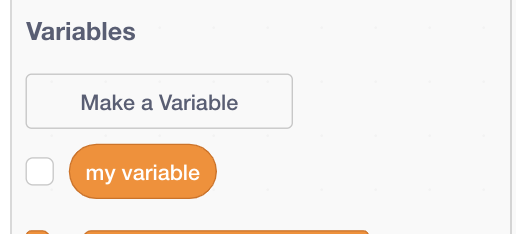

## स्कोर रखना

स्कोर बनाए रखने के लिए, आपको स्कोर को स्टोर करने के लिए, इसे जोड़ने का एक तरीका और गेम को पुनरारंभ होने पर इसे रीसेट करने का एक तरीका चाहिए।

--- task ---

पहला: इसे स्टोर करना है! **Variables** श्रेणी में जाकर **Make a Variable** दबाइए।



`score` को नाम के रूप में दर्ज कीजिए।


अपने नए चर और इसके लिए ब्लॉक की जाँच करें!


--- /task ---

--- collapse ---
---
title: variables क्या हैं?
---

जब आप किसी प्रोग्राम में जानकारी संग्रहीत करना चाहते हैं, तो आप **variable** का उपयोग करते हैं। उसे एक डिब्बे की तरह समझे जिस पर एक लेबल है: आप इसमें कुछ डाल सकते हैं, यह देख सकते हैं कि इसमें क्या है, और इसके अंदर बदलाव कर सकते है। आपको चर के तहत ** variables ** मिलेंगे, लेकिन आपको उन्हें पहले बनाने की आवश्यकता है!

--- /collapse ---

अब आपको जब भी मच्छर खाया जाए, तो variable को अपडेट करना होगा और खेल के दोबारा शुरू होने पर इसे रीसेट करना होगा:

--- task ---

--- /task ---

**वेरिएबल** श्रेणी से `set [my variable v] to [0]`{:class="block3variables"} और `change [my variable v] by [1]`{:class="block3variables"} ब्लॉक्स को लीजिए। प्रत्येक ब्लॉक में, छोटे तीर पर क्लिक करें और फिर `स्कोर` चुनें सूची से। फिर अपने प्रोग्राम में ब्लॉक डालें:

--- task ---

### तोते के लिए कोड

```blocks3
    when green flag clicked
+    set [score v] to [0]
    set rotation style [left-right v]
    go to x: (0) y: (0)
```

### मच्छर के लिए कोड

```blocks3
    if <touching [Sprite1 v] ?> then
+        change [score v] by [1]
        hide
        wait (1) secs
        go to x: (pick random (-240) to (240)) y: (pick random (-180) to (180))
        show
    end
```

--- /task ---

बढ़िया है। अब आपको एक अंक और सब कुछ मिल गया है।

--- task ---

अंत में, तोते को खेल से परिचित कराने के लिए इस कोड को जोड़ें:

```blocks3
    when green flag clicked
    set [score v] to [0]
    set rotation style [left-right v]
    go to x: (0) y: (0)
    say [Hello! I need your help.] for (3) secs
    say [Can you help me catch of all the mosquitos? Use the arrow keys.] for (4) secs
    say [Mosquitos are small flies that spread dangerous diseases like malaria.] for (5) secs
    say [Please help me catch them and protect my friends!] for (3) secs
```

--- /task ---
