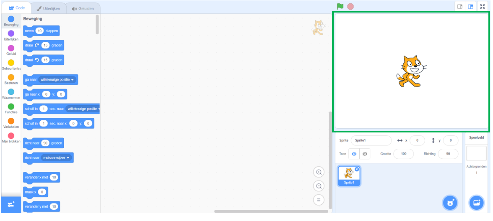
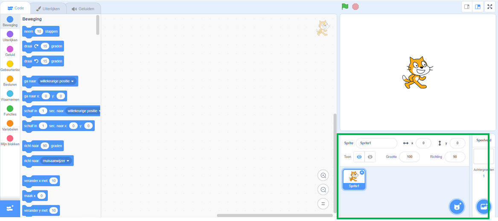
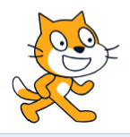
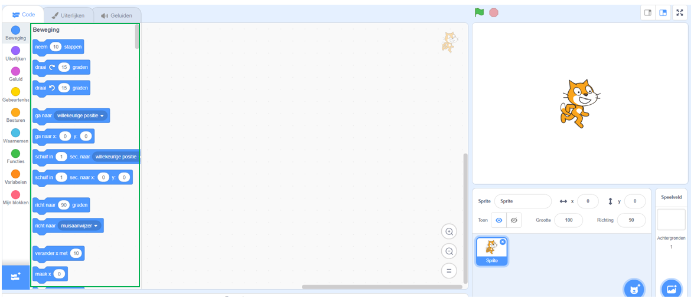
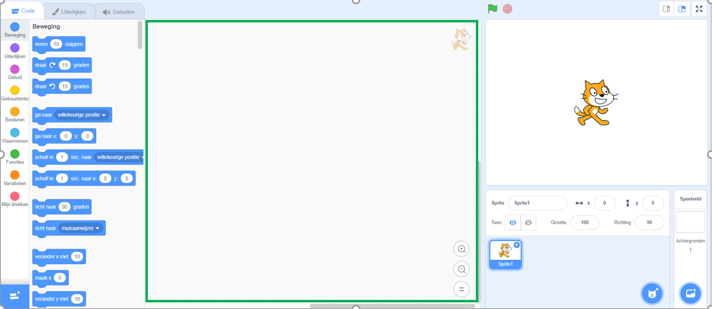

## Opstarten

Zodra je Scratch opent, zie je een scherm zoals hieronder.

+ Zoek naar elk van de volgende onderdelen en onthoud ze.

### Het speelveld

 

--- collapse ---
---
title: Wat is het speelveld?
---
Dit is waar je Scratch programma's worden uitgevoerd. Het heeft:

* Eén of meer **achtergronden** \(afbeeldingen op de achtergrond van het scherm\)

* Alle **codeblokken** die daarbij horen \(hier komen we zo op terug\)

--- /collapse ---

### De sprite lijst

 

--- collapse ---
---
title: Wat is een sprite?
---

Elk object dat in het speelveld komt, is een **sprite**.

De sprite omvat:
* De **afbeelding** op het speelveld
* Elk alternatief **uiterlijk** \(hoe het eruit ziet\) dat het heeft
* Alle **geluiden** die bij de sprite horen
* Alle **codeblokken** die bij de sprite horen 

--- /collapse ---

### Het codeblokken palet

 

--- collapse ---
---
title: Codeblokken
---

Code in Scratch wordt geleverd als blokken die je met elkaar verbindt om programma's te maken. Je kiest blokken uit het **codeblokkenpalet** en sleept ze naar het **huidige sprite paneel** en verbindt ze vervolgens.

Er zijn tien categorieën van blokken. Ze hebben een kleurcode en je kunt elke categorie selecteren in de lijst boven aan het palet met **codeblokken**.

--- /collapse ---

### Het huidige sprite paneel

 

--- collapse ---
---
title: Wat is de huidige sprite?
---

De **huidige sprite** is degene die is geselecteerd in de **sprite lijst**.

Het **huidige sprite paneel** is waar je de code, uiterlijken en geluiden voor de geselecteerde sprite kunt zien.

--- /collapse ---

Tijd om te gaan programmeren! Ga terug naar Scratch en klik op de Scratch Cat in de sprite lijst. De kat is nu de huidige sprite.

--- task ---

Ga naar de categorie **Gebeurtenissen** in het **codeblokkenpalet**, klik op het `wanneer op de groene vlag wordt geklikt`{:class="block3events"} blok en sleep het naar het **huidige sprite paneel**.

```blocks3
+ wanneer op de groene vlag wordt geklikt
```

--- /task ---

--- task ---

Ga dan naar **Uiterlijken** in het **codeblokkenpalet** en zoek het blok

```blocks3
    zeg [Hallo!] (2) sec.
```

Sleep het naar het **huidige sprite paneel** en verbind het als volgt met de onderkant van het andere blok:

```blocks3
    wanneer op de groene vlag wordt geklikt
    zeg [Hallo!] (2) sec.
```

--- /task ---

--- task ---

Klik nu op de **groene vlag** en kijk wat er gebeurt!

--- /task ---

