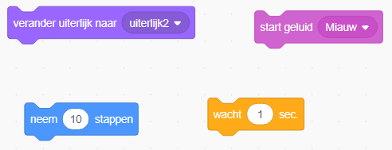
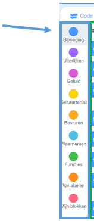
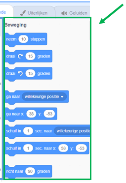
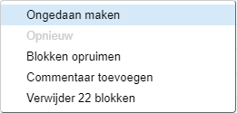

## Code toevoegen & verwijderen

Geweldig! Je hebt je eerste Scratch programma geschreven. Tijd om wat meer te leren over hoe je code in en uit Scratch kunt krijgen! Scratch code bestaat uit **blokken** die je samen klikt, zoals deze:



Je vind alle blokken in het gedeelte van **codeblokkenpalet**, waar ze zijn onderverdeeld in verschillende categorieën.

--- collapse ---
---
title: Gebruik blokken uit de verschillende categorieën
---

Klik op een categorienaam om de blokken in die categorie te zien. Hier is de **Beweging** categorie geselecteerd.



Alle blokken in de geselecteerde categorie worden in een lijst weergegeven. Kies het blok dat je wilt, klik er dan op, houdt de muisknop ingedrukt en sleep het naar het **huidige sprite paneel** en laat los.

Zodra het blok zich in het **huidige sprite paneel** bevind, kun je het verplaatsen en verbinden met andere blokken.



--- /collapse ---

Als je wilt zien wat een blok doet, kun je erop dubbelklikken om het uit te laten voeren! Dubbelklik op een aantal blokken om te zien wat ze doen.

--- collapse ---
---
title: De code uitvoeren
---

Normaal gesproken wil je dat je blokken automatisch worden uitgevoerd wanneer er iets specifieks gebeurt. Dit is de reden waarom de meeste van je programma's beginnen met een blok uit de categorie **gebeurtenissen**. Meestal zal dit deze zijn:

```blocks3
    when green flag clicked
```

De codeblokken die zijn aangesloten op dit blok worden uitgevoerd nadat op de **groene vlag** is geklikt.

Codeblokken lopen van boven naar beneden, dus de volgorde waarin je je code bij elkaar klikt. In dit voorbeeld zal de sprite `Hallo!`{:class="block3looks"} `zeggen`{:class="block3looks"} voordat het het `meow`{:class="block3sound"} geluid `afspeelt`{:class="block3sound"}.


```blocks3
    when green flag clicked
  zeg [Hallo!]
  start geluid [meow v]
```

--- /collapse ---

Het verwijderen van codeblokken die je niet wilt gebruiken in je programma is eenvoudig! Sleep ze gewoon terug naar het palet met codeblokken.

**Wees voorzichtig:** wanneer je een blok naar het codeblokkenpalet sleept, worden alle blokken die zijn verbonden met het blok dat je sleept ook verwijderd, dus zorg ervoor dat je de codeblokken die je wilt houden los maakt van de blokken die je wilt verwijderen. Als je per ongeluk enkele codeblokken verwijdert en ze wilt terughalen, kun je met de rechtermuisknop klikken en vervolgens op de optie **ongedaan maken** klikken om alles terug te krijgen.



--- task ---

Probeer enkele codeblokken toe te voegen, te verwijderen en terug te halen!

--- /task ---

### Alles bij elkaar brengen

Nu weet je hoe je code kunt verplaatsen en dingen kunt laten gebeuren, tijd om een eenvoudig programma te proberen: de Scratch Cat in een cirkel laten lopen.

--- task ---

Zorg ervoor dat je de kat in de sprite lijst hebt geselecteerd en sleep vervolgens de volgende blokken samen. Je vindt ze in de lijsten **Gebeurtenissen** en **Beweging**.

```blocks3
+    when green flag clicked
+    move [10] steps
```

--- /task ---

--- task ---

Klik vervolgens een paar keer op de groene vlag boven het **speelveld**.


---/task---

Opmerking: als je te vaak klikt en de kat wegloopt, kun je hem terug slepen!

Je zou de kat in een rechte lijn moeten zien lopen... niet precies wat je wilt, toch?

--- task ---

Voeg een draaiblok toe aan het einde om de kat in een cirkel te laten lopen. Het staat ook in de lijst **Beweging**.

```blocks3
    when green flag clicked
    move [10] steps
+    turn cw (15) degrees
```

--- /task ---

Klik nog een paar keer op de groene vlag om de kat in een cirkel te zien draaien.

--- collapse ---
---
title: Hoe werkt draaien?
---

Dit blok laat de kat 15 graden draaien van de volledige 360 graden die een cirkel vormen. Je kunt dat aantal of het aantal stappen wijzigen door op het nummer te klikken en een nieuwe waarde in te voeren.


--- /collapse ---

--- task ---

Bewaar nu je werk!

--- /task ---

