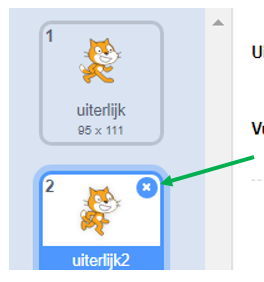

## Het instellen van de scène

Scratch heeft een bibliotheek met achtergronden en sprites die je kunt gebruiken om je project er geweldig uit te laten zien.

--- task ---

Selecteer het speelveld.

Klik op **Achtergronden**.

Klik op het pictogram **Kies een achtergrond**.

Kies dan je favoriete buiten achtergrond!

--- /task ---

Supergoed! Laten we nu de kat in een papegaai veranderen!

--- task ---

Selecteer eerst de kat en klik op het tabblad **Uiterlijken**.

Klik vervolgens op **Kies een uiterlijk**

Selecteer een papegaai en klik op **OK**.

Verwijder nu de kattenuiterlijken door elk van hen te selecteren en op **x** te klikken.

--- /task ---

Supergoed! Je hebt een papegaai!
