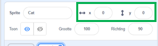

## Dingen verplaatsen

Op dit moment beweegt je papegaai in een cirkel, maar zou het niet leuker zijn om hem te besturen met de pijltjestoetsen? In deze stap leer je hoe je dat kunt doen!

--- task ---

Begin met het verwijderen van alle code die je hebt voor de papegaai.

--- /task ---

Zoals je waarschijnlijk al geraden hebt, heb je weer **gebeurtenissen** en **beweging** blokken nodig!


Zoek dit keer dit blok en sleep het naar het huidige sprite paneel:

```blocks3
    wanneer [spatiebalk] is ingedrukt
```

Klik op het pijltje (▼) naast `spatiebalk`. Je ziet een lijst met alle toetsen op je toetsenbord waaruit je kunt kiezen.

--- task ---

Je hebt vier van deze blokken nodig en je kunt ze als volgt verbinden met **beweging** blokken:

```blocks3
+ wanneer [pijltje links v] is ingedrukt
+ neem (-10) stappen
```

```blocks3
+ wanneer [pijltje rechts v] is ingedrukt
+ neem (10) stappen
```

```blocks3
+ wanneer [pijltje omhoog v] is ingedrukt
```

```blocks3
+ wanneer [pijltje omlaag v] is ingedrukt
```

--- /task ---

**Opmerking**: `-10` betekent 'ga 10 stappen terug'.

--- task ---

Klik nu op de groene vlag en druk op de pijltoetsen om je code te testen.

--- /task ---

Je papegaai beweegt nu heen en weer, wat best cool is, maar hij beweegt niet omhoog of omlaag. Als je door de blokken met **beweging** kijkt, zie je ook dat er geen blokken zijn voor 'omhoog' of 'omlaag'. Er zijn er echter een heleboel die verband houden met **x** en **y** - laten we die proberen!

--- task ---

Pak twee `verander y met`{:class="block3motion"} blokken en pas de code als volgt aan:

```blocks3
    wanneer [pijltje links v] is ingedrukt
neem (-10) stappen
```

```blocks3
    wanneer [pijltje rechts] is ingedrukt
neem (10) stappen
```

```blocks3
    wanneer [pijltje omhoog v] is ingedrukt
+ verander y met (10)
```

```blocks3
    wanneer [pijltje omlaag v] is ingedrukt
+ verander y met (-10)
```

--- /task ---

Wanneer de pijlen worden ingedrukt, kan de papegaai zich over het speelveld verplaatsen!

--- collapse ---
---
title: Hoe werken x- en y-coördinaten?
---

Wanneer programmeurs moeten praten over de posities van objecten, zoals sprites, gebruiken we vaak **x** en **y** coördinaten om ze te beschrijven. De **x-as** loopt van links naar rechts, terwijl de **y-as** van onder naar boven loopt.


Een sprite kan worden gevonden door de coördinaten van zijn middelpunt, bijvoorbeeld `(15, -27)`, waarbij `15` de positie langs de x-as is en `-27` de positie langs de y- as.

+ Om uit te proberen hoe dit werkt, selecteer je een sprite en stel je verschillende waarden in voor de `x` en `y` coördinaten om de sprite door het speelveld te verplaatsen.



+  Probeer verschillende waarden om te zien waar de sprite naartoe gaat! In Scratch loopt de x-as van `-240` tot `240`, en de y-as van `-180` tot `180`.

--- /collapse ---

### Het spel herstarten

De papegaai beweegt over het scherm, maar stel je voor dat dit een spel is: hoe herstart je het? Je moet de papegaai terugbrengen naar zijn oorspronkelijke plek zodra de speler het spel start. Ze zullen dit spel starten door op de groene vlag te klikken, dus je moet de coördinaten van de papegaai wijzigen `x` en `y` wanneer dat gebeurt.

Dat is eigenlijk vrij eenvoudig! Het midden van het speelveld is `(0,0)` op `x` en `y` coördinaten.

Dus alles wat je nodig hebt is een **gebeurtenissen** blok voor de groene vlag en het **ga naar** blok van **beweging**.

--- task ---

Sleep het `wanneer op de groene vlag wordt geklikt`{:class="block3event"} **gebeurtenissen** blok naar het huidige sprite paneel.

```blocks3
+ wanneer op de groene vlag wordt geklikt
```

Zoek vervolgens het `ga naar`{:class="block3motion"} **beweging** blok en klik het vast aan je groene vlag blok.

```blocks3
    wanneer op de groene vlag wordt geklikt
+ ga naar x: (0) y: (0)
```

Stel zowel de `x` als de `y` op `0` in in het `ga naar`{:class="block3motion"} blok als ze nog niet `0` zijn.

--- /task ---

--- task ---

 Klik nu op de groene vlag en je zou de papegaai moeten zien terugkeren naar het midden van het podium.

--- /task ---
