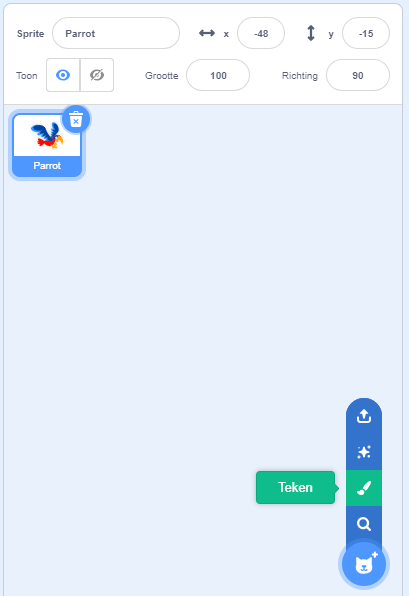
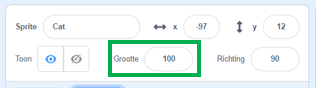
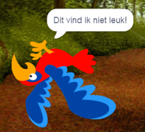

## Alle sprites

Nu heb je een papegaai die je kunt verplaatsen met behulp van de pijltjestoetsen. Gaaf! Tijd om wat muggen toe te voegen om te vangen!

--- task ---

Klik op de knop **Kies een sprite**. Scratch heeft geen kant-en-klare muggen sprites, dus je gaat er een tekenen!



Als je mug een beetje groot is in vergelijking met je papegaai, kun je grootte gebruiken om beide sprites de juiste grootte te maken!



Wijzig de waarde in het grootte element om de sprite groter of kleiner te maken.

--- /task ---

Mooi hoor! Later ga je wat code toevoegen om de mug zelfstandig te laten bewegen, zonder hulp van de speler. Je speler zal de papegaai zijn die de mug probeert te vangen.

--- collapse ---
---
title: Hoe zit het met de achteruitgaande papegaai?
---

Het ziet er een beetje vreemd uit om die papegaai achteruit te laten vliegen. Net zoals je meestal zult omdraaien in plaats van achteruit te lopen, zal de papegaai zich omdraaien in plaats van achteruit te vliegen. Gelukkig voor jou heeft Scratch hier een blok voor!

Met het `richt naar graden`{:class="block3motion"} kun je de richting kiezen waarin je sprite wijst. Je vindt het in het gedeelte **Beweging** blokken. Je kunt een willekeurig aantal graden typen om het sprite naar welke plek dan ook te laten wijzen.

--- /collapse ---

--- task ---

Pak een paar `richt naar graden`{:class="block3motion"} blokken uit de **Beweging** lijst en verbind ze als volgt met de code van je papegaai:

```blocks3
    wanneer [pijltje links v] is ingedrukt
+ richt naar (-90) graden
    neem (-10) stappen
```

```blocks3
    wanneer [pijltje rechts v] is ingedrukt
+ richt naar (90) graden
    neem (10) stappen
```

--- /task ---

--- task ---

Aangezien de papegaai is omgedraaid, wijzig je de richting waarin hij vliegt wanneer de linkerpijl wordt ingedrukt:

```blocks3
    wanneer [pijltje links v] is ingedrukt
    richt naar (-90) graden
+ neem (10) stappen
```

--- /task ---

Als je probeerde de papegaai te verplaatsen nadat je het `richt naar graden`{:class="block3motion"} blokken had toegevoegd, heb je misschien iets vreemds opgemerkt. De papegaai draait misschien niet helemaal goed!



--- collapse ---
---
title: Waarom draait hij ondersteboven?
---

Het probleem hier is dat de papegaaien sprite, net als alle sprites, is begonnen met de 'helemaal rond' **draaistijl**, en wat je nodig hebt is de stijl 'links-rechts'.

Zoals gewoonlijk is daar een blok voor en het staat in **Beweging**!

--- /collapse ---

--- task ---

Kijk in de categorie **Beweging** voor het blok `maak draaistijl`{:class="block3motion"}.

Voeg het blok toe aan je herstartcode van eerder en stel de draaistijl in op `links-rechts`{:class="block3motion"}, zoals dit:

```blocks3
    wanneer op de groene vlag wordt geklikt
+ maak draaistijl [links-rechts v]
    ga naar x: (0) y: (0)
```

--- /task ---

