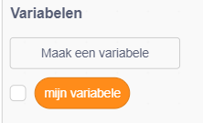
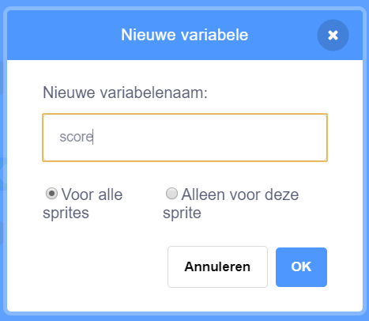
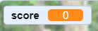

## Score bijhouden

Om de score bij te houden, moet je ergens de score opslaan, een manier hebben om deze te verhogen en een manier om deze opnieuw in te stellen wanneer het spel opnieuw wordt gestart.

--- task ---

Ten eerste: opslaan! Ga naar de categorie **variabelen** blokken en klik op **Maak een variabele**.



Type `score` als de naam.



Bekijk je nieuwe variabele en de blokken die erbij horen!



--- /task ---

--- collapse ---
---
title: Wat zijn variabelen?
---

Als je informatie wilt opslaan in een programma, dan gebruik je iets dat **variabele** heet. Zie het als een doos met een label erop: je kunt er iets instoppen, controleren wat er in zit, en veranderen wat er in zit. Je vindt variabelen onder **Variabelen**, maar je moet ze eerst maken!

--- /collapse ---

Nu moet je de variabele bijwerken wanneer een mug wordt opgegeten, en deze opnieuw instellen wanneer het spel opnieuw wordt gestart:

--- task ---

--- /task ---

Pak uit de **Variabelen** categorie de `maak [mijn variabele v] [0]`{:class="block3variables"} en `verander [mijn variabele v] met [1]`{:class="block3variables"} blokken. Klik in elk van de blokken op de kleine pijl en kies vervolgens `score` uit de lijst. Plaats vervolgens de blokken in je programma:

--- task ---

### Code voor de papegaai

```blocks3
    when green flag clicked
+ maak [score v] [0]
maak draaistijl [links-rechts v]
ga naar x: (0) y: (0)
```

### Code voor de mug

```blocks3
    als <raak ik [Sprite1 v]> dan
+ change [score v] by [1]
verdwijn
wacht (1) sec.
ga naar x: (willekeurig getal tussen (-240) en (240)) y: (willekeurig getal tussen (-180) en (180))
verschijn
einde
```

--- /task ---

Gaaf! Nu heb je zelfs een score.

--- task ---

Voeg ten slotte deze code toe om de papegaai het spel te laten uitleggen:

```blocks3
    when green flag clicked
    set [score v] to [0]
    maak draaistijl [links-rechts v]
    ga naar x: (0) y: (0)
    zeg [Hallo! Ik heb je hulp nodig.] (3) sec.
    zeg [Kun je me helpen met het vangen van alle muggen? Gebruik de pijltjestoetsen.] (4) sec.
    zeg [Muggen zijn kleine vliegen die gevaarlijke ziekten verspreiden zoals malaria.] (5) sec.
    zeg [Help me alsjeblieft om ze te vangen en mijn vrienden te beschermen!] (3) sec.
```

--- /task ---
